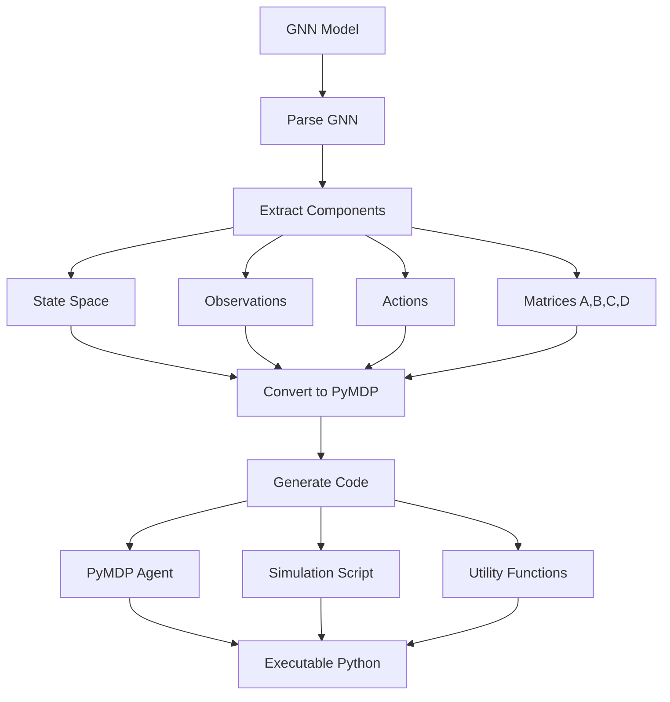

# PyMDP Rendering Module

This submodule handles code generation specifically for PyMDP (Python active inference framework) simulations.

## Overview

PyMDP is a Python implementation of Active Inference for partially observable Markov decision processes (POMDPs). This module generates complete, executable PyMDP simulation code from GNN specifications.

## Module Structure

```
src/render/pymdp/
├── __init__.py                    # Module initialization and exports
├── README.md                      # This documentation
├── AGENTS.md                      # Detailed agent scaffolding
├── pymdp_renderer.py              # Main PyMDP renderer
├── pymdp_converter.py             # GNN to PyMDP converter
├── pymdp_templates.py             # Code templates
└── pymdp_utils.py                 # Utility functions
```

## Core Components

### PyMDP Renderer (`pymdp_renderer.py`)

**Purpose**: Generate executable PyMDP code from GNN models

**Key Functions**:
- `generate_pymdp_code()` - Main code generation function
- `render_agent()` - Render agent configuration
- `render_matrices()` - Generate A, B, C, D, E matrices
- `optimize_for_performance()` - Apply PyMDP optimizations

### Code Templates (`pymdp_templates.py`)

**Purpose**: Provide PyMDP code templates for consistent generation

**Templates Available**:
- Basic agent template
- POMDP solver template
- Active inference loop template
- Visualization helper template

## PyMDP Rendering Pipeline



## Features

- Full PyMDP agent implementation generation
- Automatic matrix optimization
- Performance tuning for large models
- Integration with PyMDP inference engines
- Example simulation generation

## Usage

```python
from render.pymdp import generate_pymdp_code

code = generate_pymdp_code(
    model_data=parsed_gnn_model,
    output_path="output.py"
)
```

## Output

Generated PyMDP code is fully executable and includes:
- Complete agent initialization
- Inference loop
- Result collection
- Performance reporting

## Dependencies

- `pymdp` - PyMDP package (optional, fallback: skip PyMDP generation)
- `numpy` - Numerical arrays
- `pathlib` - File path handling

## Testing

Comprehensive tests ensure:
- Code generation correctness
- Matrix consistency
- Execution without errors
- Output validation

---

**Last Updated**: October 28, 2025  
**Status**: ✅ Production Ready


