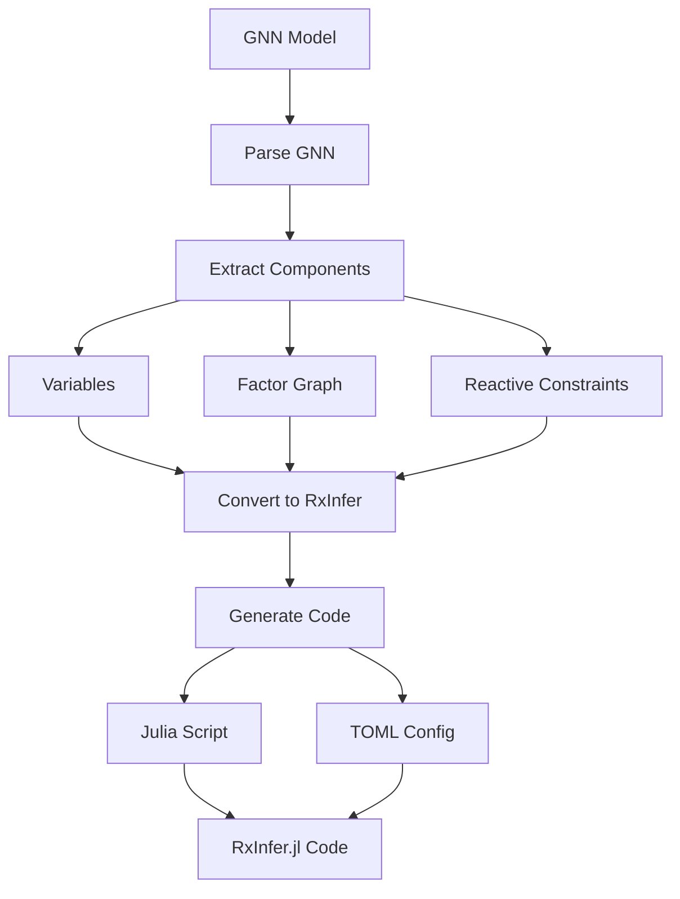

# RxInfer Module for GNN

This module handles the integration between GNN specifications and [RxInfer.jl](https://github.com/biaslab/RxInfer.jl), enabling the rendering and execution of RxInfer.jl simulations from GNN models.

## Overview

The RxInfer module is part of the GNN Processing Pipeline and works in conjunction with the rendering pipeline step (`11_render.py`) and execution pipeline step (`12_execute.py`). It provides tools for:

1. Parsing GNN files into structured representations
2. Generating RxInfer.jl configuration files (TOML)
3. Generating RxInfer.jl simulation scripts (Julia)
4. Executing RxInfer.jl simulations

## RxInfer.jl Rendering Pipeline



## Integration with the Pipeline

This module integrates with the GNN pipeline in the following ways:

- **Rendering (Step 11)**: The `11_render.py` script uses the functionality in `src/render/rxinfer.py` to render GNN specifications to RxInfer.jl configurations and scripts.
- **Execution (Step 12)**: The `12_execute.py` script uses the `src/execute/rxinfer_runner.py` to execute the generated RxInfer.jl simulations.
- **Standalone Usage**: The `src/rxinfer.py` script provides a standalone interface for processing GNN files directly to RxInfer.jl configurations.

## POMDP Implementation

The RxInfer.jl renderer generates full Active Inference POMDP simulations with:

### Matrix Extraction
- **A matrix**: Observation model P(o|s) - extracted from `initialparameterization.A`
- **B matrix**: Transition model P(s'|s,a) - 3D tensor with action dimension from `initialparameterization.B`
- **D vector**: Prior over initial states from `initialparameterization.D`

### Parameter Detection
The renderer extracts `num_actions` from multiple possible GNN spec keys (in priority order):
1. `model_parameters.num_actions`
2. `model_parameters.num_controls`
3. `model_parameters.n_actions`
4. Inferred from B matrix dimensions (length of B array)
5. Default: 3

### Output Structure
```
simulation_results.json
├── framework: "rxinfer"
├── beliefs: [[p1, p2, p3], ...]  # Non-uniform posteriors
├── true_states: [...]
├── observations: [...]
├── actions: [...]
├── validation:
│   ├── beliefs_valid: true
│   └── beliefs_sum_to_one: true
└── rxinfer_results.png  # Belief evolution plot
```

## Standalone Usage

The `rxinfer.py` script can be used as a standalone tool for processing GNN files to RxInfer.jl configurations:

```bash
# Process a single GNN file
python src/rxinfer.py path/to/gnn_file.md --output-dir path/to/output

# Process a directory of GNN files
python src/rxinfer.py path/to/gnn_files/ --output-dir path/to/output

# Generate TOML configuration files instead of Julia files
python src/rxinfer.py path/to/gnn_file.md --output-dir path/to/output --toml

# Enable debug logging
python src/rxinfer.py path/to/gnn_file.md --output-dir path/to/output --debug
```

## Module Structure

- `gnn_parser.py`: Functions for parsing GNN files into structured representations
- `config_generator.py`: Functions for generating RxInfer.jl configuration files
- `toml_generator.py`: Functions for generating TOML configuration files
- Example configuration files for reference

## Requirements

- Python 3.8+
- Julia 1.6+ (for executing RxInfer.jl simulations)
- RxInfer.jl package (will be automatically installed by the runner script if not present)

## Notes for Developers

If you need to extend the RxInfer integration:

1. Add new parsing functionality to `gnn_parser.py`
2. Add new generation functionality to `config_generator.py` or `toml_generator.py`
3. Update the standalone `rxinfer.py` script to use the new functionality
4. Update the test configuration files as needed

The RxInfer execution requires Julia to be installed on the system. The execution step will check for Julia availability and install required packages if needed. 