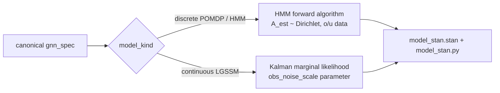

# Stan Renderer

`src/render/stan/` renders a GNN model to a **runnable Stan program** plus a
cmdstanpy driver that Step 12 executes.



## Usage

```python
from render.stan import render_gnn_to_stan

ok, message, artifacts = render_gnn_to_stan(gnn_spec, output_dir / "model_stan.py")
# artifacts == [".../model_stan.py", ".../model_stan.stan"]
```

`render_stan(variables, connections)` still exists as a declaration-only
structural sketch (data/parameters blocks plus commented edges); it is not an
inference program and is not what the pipeline executes.

## Discrete models

Data: the observation sequence `o[1:T]` and actions `u[1:T-1]` (simulated by
the driver from the GNN's A/B/D with a seeded uniform-random policy), the
known transition tensor `B[a][s_next, s_prev]` and prior `D`. Parameters: one
simplex per hidden state `A_est[s]` = P(o | s) with a Dirichlet prior
`1 + strength · A[:, s]` (`ModelParameters.stan_dirichlet_strength`, default 20).
The latent chain is marginalised with a vectorised, scaled forward algorithm
(`alpha_t ∝ A[o_t,:] .* (B[u_{t-1}] alpha_{t-1})`); `filtered_state[t]` and
`log_marginal` are transformed parameters. The driver samples with NUTS when
`S·O ≤ stan_nuts_param_budget` (default 1024 simplex parameters) and otherwise
fits the MAP with L-BFGS (`jacobian=True`) so large joint compositions such as
the 729-state stigmergic swarm finish in seconds rather than hours.

## Continuous models

Data: `F, H, Q, R, prior_mean, prior_cov`, observations `y[1:T]` and controls
`u[1:T]`. Parameter: `obs_noise_scale` (lognormal prior) scaling `R`. The
Kalman predict/update recursion is written out in `transformed parameters`
and the innovations' `multi_normal_lpdf` form the likelihood; filtered means
and covariances are returned as transformed parameters.

Execution and the result schema are documented in `src/execute/stan/`.
