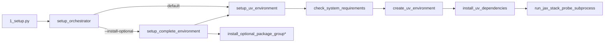

# Setup Module (Step 1)

Environment setup and dependency management for the GNN pipeline. Delegates all package
operations to [uv](https://docs.astral.sh/uv/) and reads dependencies from
`pyproject.toml` / `uv.lock`.

The thin orchestrator [`src/1_setup.py`](../1_setup.py) calls functions exported here.

## Module Layout

```
src/setup/
├── __init__.py           # Public API (see __all__)
├── constants.py          # Paths, minimum Python version, OPTIONAL_GROUPS table
├── setup.py              # `perform_full_setup` — three-phase orchestration
├── uv_management.py      # Env creation, uv sync, probes, health checks
├── uv_package_ops.py     # `uv add` / `uv remove` / `uv sync` / `uv lock`
├── dependency_setup.py   # JAX stack probe, optional group install, project init
├── utils.py              # Directory helpers, module info, output paths
├── validator.py          # System / environment / uv status reports
├── mcp.py                # MCP tool registrations
├── AGENTS.md             # Agentic overview (API signatures)
├── SPEC.md               # Component breakdown
└── SKILL.md              # Capability card for LLM consumers
```

## Setup Workflow



## Public API

The sections below list what is exported via `src/setup/__init__.py`. Every signature below
matches the implementation. Prefer importing from the package root (`from setup import …`)
rather than submodules.

### Environment setup

| Function | Defined in | Summary |
|----------|-----------|---------|
| `setup_uv_environment(verbose=False, recreate=False, dev=False, extras=None, install_all_extras=False, skip_jax_test=False, output_dir=None)` | `uv_management` | End-to-end env creation + `uv sync` + optional JAX probe |
| `install_uv_dependencies(verbose=False, dev=False, extras=None, install_all_extras=False)` | `uv_management` | `uv sync` with selected `--extra`/`--all-extras` flags |
| `validate_uv_setup()` | `uv_management` | Structured dict of venv/python/uv status |
| `cleanup_uv_setup(verbose=False)` | `uv_management` | Best-effort removal of `.venv` |
| `get_uv_setup_info()` | `uv_management` | Current uv version, lock hash, platform metadata |
| `check_system_requirements(verbose=False) -> bool` | `uv_management` | Minimum Python, memory, disk checks |
| `check_uv_availability() -> bool` | `uv_management` | Whether `uv` is on `PATH` |
| `check_environment_health()` | `uv_management` | Aggregate venv health report |
| `log_system_info(verbose=False)` | `uv_management` | Emits platform and interpreter info |
| `get_installed_package_versions()` | `uv_management` | Dict of installed package → version |

### Native uv operations (`uv_package_ops`)

```python
add_uv_dependency(package: str, dev: bool = False, verbose: bool = False) -> bool
remove_uv_dependency(package: str, verbose: bool = False) -> bool
update_uv_dependencies(verbose: bool = False, upgrade: bool = False) -> bool
lock_uv_dependencies(verbose: bool = False) -> bool
```

### Optional dependency groups (`dependency_setup`)

```python
install_optional_dependencies(verbose: bool = False) -> bool
install_optional_package_group(group_name: str, verbose: bool = False) -> bool
install_all_optional_packages(verbose: bool = False) -> bool
setup_complete_environment(verbose=False, recreate=False, install_optional=False,
                           optional_groups: list[str] | None = None,
                           output_dir: Path | None = None) -> bool
setup_gnn_project(project_name: str, base_dir: Path, verbose: bool = False) -> bool
create_project_structure(project_root: Path, verbose: bool = False) -> bool
install_jax_and_test(verbose: bool = False) -> bool
```

Valid group names are defined in `OPTIONAL_GROUPS` (`constants.py`):
`dev`, `active-inference`, `ml-ai`, `llm`, `visualization`, `inference`, `audio`, `gui`,
`graphs`, `research`, `scaling`, `database`, `probabilistic-programming`,
`execution-frameworks`, `all`.

Step 12 backends (JAX, NumPyro, PyTorch, DisCoPy) are already in `[project.dependencies]`,
so `uv sync` installs them without any extra. The `execution-frameworks` group simply
duplicates those pins so a user can request them explicitly.

### Validators (`validator`)

```python
validate_system() -> dict        # {"success": bool, "message"|"error": str}
get_environment_info() -> dict   # uv + package versions
get_uv_status() -> dict          # uv availability and setup info
```

### Helpers (`utils`)

```python
ensure_directory(path: Path) -> Path
find_gnn_files(directory: Path, recursive: bool = True) -> list[Path]
get_output_paths(base_output_dir: Path) -> dict[str, Path]
get_module_info() -> dict
get_setup_options() -> dict
setup_environment(verbose=False, **kwargs) -> bool     # thin wrapper around uv_management
install_dependencies(verbose=False, **kwargs) -> bool  # thin wrapper around uv_management
```

### Orchestration

`perform_full_setup(verbose=False, recreate_venv=False, dev=False, extras=None,
skip_jax_test=False) -> int` in `setup.py` runs the three-phase flow
(requirements → env → dependencies → optional JAX probe) and returns a shell exit code.
The thin orchestrator `src/1_setup.py` defines `setup_orchestrator(target_dir, output_dir,
logger, **kwargs)` which wraps `perform_full_setup` / `setup_complete_environment`.

### Package metadata

- `__version__` — currently `"1.6.0"`
- `FEATURES` — dict of capability flags (see `__init__.py`)
- `OPTIONAL_GROUPS` — name → description map used by Step 1 CLI help
- `EnvironmentManager`, `VirtualEnvironment` — thin classes kept for test shims
- `validate_environment()`, `check_python_version()` — small helpers used by tests

## Usage

### From the command line

```bash
# Default: uv sync core dependencies (Step 12 backends already included).
python src/1_setup.py --target-dir input/gnn_files --output-dir output --verbose

# Skip JAX/Optax/Flax/pymdp self-test
python src/1_setup.py --setup-core-only --verbose

# Development tools (pytest, ruff, mypy, …)
python src/1_setup.py --dev --verbose

# Every optional group
python src/1_setup.py --install-all-extras --verbose

# Specific groups
python src/1_setup.py --install-optional --optional-groups "llm,visualization" --verbose
```

### Programmatic

```python
from setup import setup_uv_environment, install_optional_package_group

setup_uv_environment(verbose=True, dev=True)
install_optional_package_group("visualization", verbose=True)
```

### `uv` directly

```bash
uv sync                     # Core (JAX, NumPyro, PyTorch, DisCoPy, pymdp, …)
uv sync --extra dev         # Add dev tools
uv sync --extra visualization
uv sync --all-extras        # Everything
```

## Output

Step 1 writes artifacts under `output/1_setup_output/`:

```
output/1_setup_output/
├── setup_summary.json        # High-level result and timings
├── environment_info.json     # Python + uv + platform info
├── dependency_status.json    # Installed packages and versions
└── setup_log.txt             # Emitted logger output
```

The root `uv.lock` file is updated by `uv` itself when any sync operation runs.

## Error Handling

- Missing `uv` → `check_uv_availability()` returns `False`; callers log a clear error and
  point at <https://docs.astral.sh/uv/>.
- `uv sync` failure → surfaced via `subprocess.CompletedProcess.returncode`; logs include
  captured stdout/stderr and return `False`.
- JAX probe failure → a single `uv sync` retry with `SETUP_DEFAULT_PIPELINE_EXTRAS`, then
  a final warning; Step 1 still returns success so the pipeline continues.
- Lock file conflicts → regenerate with `uv lock` (`lock_uv_dependencies`).

## Testing

```bash
uv run pytest src/tests/test_setup_overall.py -v
uv run pytest src/tests/test_uv_environment.py -v
uv run pytest src/tests/test_environment_overall.py -v
```

The tests cover: environment creation, `uv sync` invocation, optional-group installation,
system requirement validation, and the JAX stack probe.

## MCP Integration

`mcp.py` registers the following tools with the GNN MCP server:

- `setup.check_environment`
- `setup.create_environment`
- `setup.install_dependencies`
- `setup.validate_setup`
- `setup.add_dependency`
- `setup.remove_dependency`
- `setup.update_dependencies`
- `setup.lock_dependencies`

## References

- [`src/1_setup.py`](../1_setup.py) — thin orchestrator
- [`pyproject.toml`](../../pyproject.toml) — dependency declarations and extras
- [`SETUP_GUIDE.md`](../../SETUP_GUIDE.md) — end-to-end install walkthrough
- [`doc/gnn/modules/01_setup.md`](../../doc/gnn/modules/01_setup.md) — module documentation

---

## Documentation

- **[README](README.md)** — this file
- **[AGENTS](AGENTS.md)** — agent-facing overview
- **[SPEC](SPEC.md)** — component breakdown
- **[SKILL](SKILL.md)** — capability card
