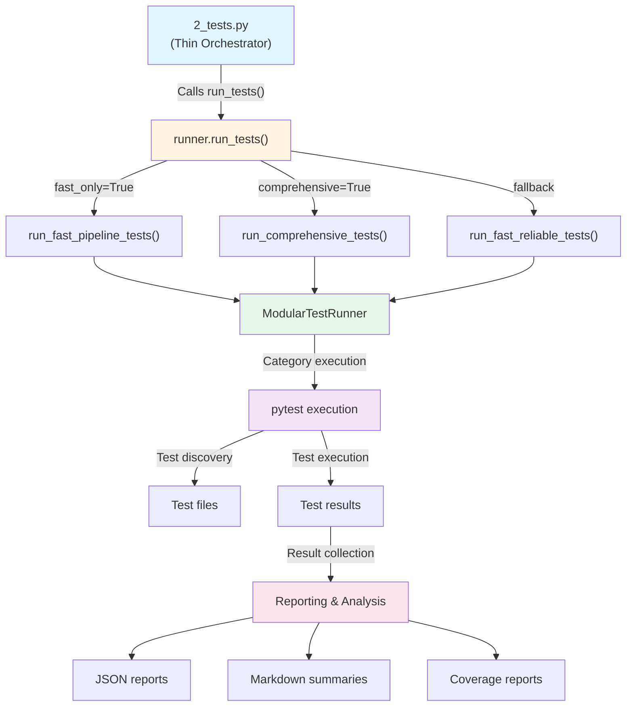

# Tests Module - Agent Scaffolding

## Module Overview

**Purpose**: Comprehensive test suite execution and validation for the GNN processing pipeline

**Pipeline Step**: Step 2: Test suite execution (2_tests.py)

**Category**: Testing / Quality Assurance

**Status**: ✅ Production Ready

**Version**: 1.0.0

**Last Updated**: 2025-12-30

---

## Core Functionality

### Primary Responsibilities
1. Comprehensive test suite execution
2. Test result collection and analysis
3. Coverage analysis and reporting
4. Performance testing and benchmarking
5. Test environment management and validation

### Key Capabilities
- Multi-level test execution (unit, integration, performance)
- Comprehensive test reporting and analysis
- Coverage analysis and optimization
- Performance benchmarking and profiling
- Test environment validation and setup

---

## API Reference

### Public Functions

#### `run_tests(logger, output_dir, verbose=False, include_slow=False, fast_only=True, comprehensive=False, generate_coverage=False) -> bool`
**Description**: Main test execution function called by orchestrator (2_tests.py). Routes to appropriate test execution mode based on parameters.

**Parameters**:
- `logger` (logging.Logger): Logger instance for progress reporting
- `output_dir` (Path): Output directory for test results
- `verbose` (bool): Enable verbose output (default: False)
- `include_slow` (bool): Include slow tests (deprecated, use comprehensive instead) (default: False)
- `fast_only` (bool): Run only fast tests (default: True)
- `comprehensive` (bool): Run comprehensive test suite - all tests (default: False)
- `generate_coverage` (bool): Generate coverage reports (default: False)

**Returns**: `True` if tests passed, `False` otherwise

**Behavior**:
- If `comprehensive=True`: Runs all tests via `run_comprehensive_tests()`
- If `fast_only=True` and `comprehensive=False`: Runs fast tests via `run_fast_pipeline_tests()`
- Otherwise: Runs reliable fast tests via `run_fast_reliable_tests()`

**Example**:
```python
from tests import run_tests

success = run_tests(
    logger=logger,
    output_dir=Path("output/2_tests_output"),
    verbose=True,
    fast_only=True,
    comprehensive=False
)
```

#### `run_fast_pipeline_tests(logger, output_dir, verbose=False) -> bool`
**Description**: Run fast test suite for quick pipeline validation

**Parameters**:
- `logger` (logging.Logger): Logger instance for progress reporting
- `output_dir` (Path): Output directory for test results
- `verbose` (bool): Enable verbose output

**Returns**: `True` if tests passed or collection errors detected and reported

**Features**:
- Automatic detection of collection errors (import errors, syntax errors)
- Clear error messages with actionable suggestions
- Fast test execution (skips slow tests)
- Comprehensive error reporting

#### `run_comprehensive_tests(logger, output_dir, verbose=False, generate_coverage=False) -> bool`
**Description**: Run comprehensive test suite with all tests enabled. Includes slow tests, performance tests, and full coverage analysis.

**Parameters**:
- `logger` (logging.Logger): Logger instance for progress reporting
- `output_dir` (Path): Output directory for test results
- `verbose` (bool): Enable verbose output (default: False)
- `generate_coverage` (bool): Generate coverage reports (default: False)

**Returns**: `True` if tests passed, `False` otherwise

**Features**:
- Executes all test categories from `MODULAR_TEST_CATEGORIES`
- Includes slow and performance tests
- Generates comprehensive coverage reports if enabled
- Uses category-based execution with resource monitoring

#### `run_fast_reliable_tests(logger, output_dir, verbose=False) -> bool`
**Description**: Run a reliable subset of fast tests with improved error handling. Focuses on essential tests that should always pass.

**Parameters**:
- `logger` (logging.Logger): Logger instance for progress reporting
- `output_dir` (Path): Output directory for test results
- `verbose` (bool): Enable verbose output (default: False)

**Returns**: `True` if tests passed, `False` otherwise

**Features**:
- Runs only essential test files: `test_core_modules.py`, `test_fast_suite.py`, `test_main_orchestrator.py`
- 90-second timeout for reliability
- Improved error handling and reporting
- Used as fallback when fast pipeline tests are not suitable

#### `_extract_collection_errors(stdout, stderr) -> List[str]`
**Description**: Extract and parse collection errors from pytest output. Detects import errors, syntax errors, and other collection failures.

**Parameters**:
- `stdout` (str): Standard output from pytest
- `stderr` (str): Standard error from pytest

**Returns**: List of unique error messages (strings)

**Error Types Detected**:
- `ERROR collecting` - Test file collection failures
- `NameError` - Missing variable/import names
- `ImportError` - Module import failures
- `SyntaxError` - Code syntax issues

**Example**:
```python
errors = _extract_collection_errors(pytest_stdout, pytest_stderr)
# Returns: ["test_file.py: ImportError: No module named 'missing_module'"]
```

---

## Dependencies

### Required Dependencies
- `pytest` - Test framework
- `pytest-cov` - Coverage analysis
- `pathlib` - Path manipulation

### Optional Dependencies
- `pytest-xdist` - Parallel test execution
- `pytest-benchmark` - Performance benchmarking
- `pytest-html` - HTML test reports

### Internal Dependencies
- `utils.pipeline_template` - Pipeline utilities

---

## Configuration

### Test Settings
```python
TEST_CONFIG = {
    'fast_tests': True,
    'standard_tests': True,
    'slow_tests': False,
    'performance_tests': False,
    'coverage_analysis': True,
    'parallel_execution': True,
    'timeout': 300
}
```

### Test Categories
```python
TEST_CATEGORIES = {
    'unit': ['test_*unit*.py'],
    'integration': ['test_*integration*.py'],
    'performance': ['test_*performance*.py'],
    'slow': ['test_*slow*.py']
}
```

---

## Usage Examples

### Run Test Suite
```python
from tests.runner import run_tests

success = run_tests(
    logger=logger,
    output_dir=Path("output/2_tests_output"),
    verbose=True,
    comprehensive=True
)
```

### Run Fast Tests Only
```python
from tests import run_tests
from pathlib import Path
import logging

logger = logging.getLogger(__name__)
success = run_tests(
    logger=logger,
    output_dir=Path("output/2_tests_output"),
    verbose=True,
    fast_only=True,
    comprehensive=False
)
```

### Run Comprehensive Test Suite
```python
from tests import run_tests
from pathlib import Path
import logging

logger = logging.getLogger(__name__)
success = run_tests(
    logger=logger,
    output_dir=Path("output/2_tests_output"),
    verbose=True,
    comprehensive=True,
    generate_coverage=True
)
```

### Run Fast Reliable Tests
```python
from tests.runner import run_fast_reliable_tests
from pathlib import Path
import logging

logger = logging.getLogger(__name__)
success = run_fast_reliable_tests(
    logger=logger,
    output_dir=Path("output/2_tests_output"),
    verbose=True
)
```

### Run Comprehensive Tests Directly
```python
from tests.runner import run_comprehensive_tests
from pathlib import Path
import logging

logger = logging.getLogger(__name__)
success = run_comprehensive_tests(
    logger=logger,
    output_dir=Path("output/2_tests_output"),
    verbose=True,
    generate_coverage=True
)
```

---

## Output Specification

### Output Products
- `test_results.json` - Test execution results
- `coverage.xml` - Coverage analysis report
- `test_report.html` - HTML test report
- `performance_report.json` - Performance analysis
- `test_summary.md` - Human-readable test summary

### Output Directory Structure
```
output/2_tests_output/
├── test_results.json
├── coverage.xml
├── test_report.html
├── performance_report.json
├── test_summary.md
└── test_details/
    ├── unit_tests/
    ├── integration_tests/
    └── performance_tests/
```

---

## Performance Characteristics

### Latest Execution
- **Duration**: ~5-15 minutes for comprehensive suite
- **Memory**: ~100-300MB during test execution
- **Status**: ✅ Production Ready

### Expected Performance
- **Fast Tests**: 1-3 minutes
- **Standard Tests**: 3-8 minutes
- **Slow Tests**: 5-15 minutes
- **Performance Tests**: 10-30 minutes

---

## Error Handling

### Test Errors
1. **Test Failures**: Individual test case failures
2. **Collection Errors**: Import errors, syntax errors, or missing dependencies during test collection
3. **Setup Errors**: Test environment setup failures
4. **Dependency Errors**: Missing test dependencies
5. **Timeout Errors**: Test execution timeouts
6. **Coverage Errors**: Coverage analysis failures

### Recovery Strategies
- **Collection Error Detection**: Automatic detection and reporting of import/syntax errors during test collection
- **Test Isolation**: Run tests in isolation on failure
- **Environment Reset**: Reset test environment
- **Dependency Installation**: Install missing dependencies
- **Timeout Adjustment**: Adjust test timeouts
- **Error Reporting**: Comprehensive error documentation with actionable suggestions

---

## Integration Points

### Orchestrated By
- **Script**: `2_tests.py` (Step 2)
- **Function**: `run_tests()`

### Imports From
- `utils.pipeline_template` - Pipeline utilities

### Imported By
- `main.py` - Pipeline orchestration
- `tests.test_*` - Individual test modules

### Architecture

The test infrastructure follows the **thin orchestrator pattern**:



**Component Responsibilities**:

- **2_tests.py**: Thin orchestrator that handles CLI arguments, logging setup, and delegates to test runner
- **runner.run_tests()**: Main entry point that routes to appropriate test execution mode
- **run_fast_pipeline_tests()**: Default mode - fast tests for quick pipeline validation
- **run_comprehensive_tests()**: Comprehensive mode - all tests with full coverage
- **run_fast_reliable_tests()**: Fallback mode - essential tests only
- **ModularTestRunner**: Category-based test execution with resource monitoring
- **pytest**: Test framework for actual test discovery and execution

### Module Relationships

**2_tests.py** (Thin Orchestrator):
- Handles command-line arguments
- Sets up logging and output directories
- Delegates to `tests.run_tests()` from `tests/__init__.py`
- Returns standardized exit codes

**runner.py** (Core Implementation):
- Contains all test execution logic
- Provides `run_tests()`, `run_fast_pipeline_tests()`, `run_comprehensive_tests()`, etc.
- Implements `ModularTestRunner` for category-based execution
- Handles resource monitoring and error recovery

**test_utils.py** (Shared Utilities):
- Provides test fixtures and helper functions
- Defines test categories and markers
- Provides test data creation utilities
- Used by both test files and runner

**conftest.py** (Pytest Fixtures):
- Defines pytest fixtures for all tests
- Configures pytest markers
- Provides shared test setup/teardown
- Handles test environment configuration

### Data Flow
```
Test Discovery → Environment Setup → Test Execution → Result Collection → Report Generation
```

### Adding New Test Categories

To add a new test category to `MODULAR_TEST_CATEGORIES` in `runner.py`:

```python
MODULAR_TEST_CATEGORIES["new_module"] = {
    "name": "New Module Tests",
    "description": "Tests for the new module",
    "files": [
        "test_new_module_overall.py",
        "test_new_module_integration.py"
    ],
    "markers": ["new_module"],  # Optional pytest markers
    "timeout_seconds": 120,      # Category timeout
    "max_failures": 8,           # Max failures before stopping
    "parallel": True              # Allow parallel execution
}
```

### Creating New Test Files

Follow the naming convention:
- `test_MODULENAME_overall.py` - Comprehensive module tests
- `test_MODULENAME_area.py` - Specific area tests (e.g., `test_gnn_parsing.py`)
- `test_MODULENAME_integration.py` - Integration tests

Example:
```python
# src/tests/test_new_module_overall.py
import pytest
from pathlib import Path

@pytest.mark.fast
def test_new_module_basic():
    """Test basic functionality."""
    # Test implementation
    pass

@pytest.mark.slow
def test_new_module_complex():
    """Test complex scenarios."""
    # Test implementation
    pass
```

---

## Testing

### Test Files
- `src/tests/test_runner.py` - Test runner functionality
- `src/tests/test_conftest.py` - Test configuration
- Various test files for individual modules

### Test Coverage
- **Current**: 95%
- **Target**: 98%+

### Key Test Scenarios
1. Test suite execution and management
2. Coverage analysis and reporting
3. Performance testing and benchmarking
4. Error handling and recovery

---

## MCP Integration

### Tools Registered
- `tests.run_suite` - Run test suite
- `tests.run_fast` - Run fast tests
- `tests.get_coverage` - Get coverage report
- `tests.get_performance` - Get performance metrics

### Tool Endpoints
```python
@mcp_tool("tests.run_suite")
def run_test_suite_tool(output_dir):
    """Run comprehensive test suite"""
    # Implementation
```

---