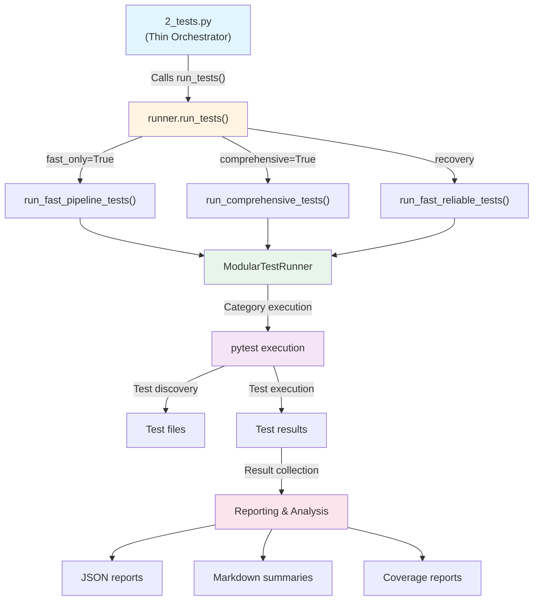

# Tests Module - Agent Scaffolding

## Module Overview

**Purpose**: Comprehensive test suite execution and validation for the GNN processing pipeline

**Pipeline Step**: Step 2: Test suite execution (2_tests.py)

**Category**: Testing / Quality Assurance

**Status**: Production Ready

**Version**: 3.2.0

**Last Updated**: 2026-09-04

---

## Core Functionality

### Primary Responsibilities
1. Comprehensive test suite execution
2. Test result collection and analysis
3. Coverage analysis and reporting
4. Performance testing and benchmarking
5. Test environment management and validation

### Key Capabilities
- Multi-level test execution (unit, integration, performance)
- Comprehensive test reporting and analysis
- Coverage analysis and optimization
- Performance benchmarking and profiling
- Test environment validation and setup

---

## API Reference

### Public Functions

#### `run_tests(logger, output_dir, verbose=False, fast_only=True, comprehensive=False, generate_coverage=False, auto_fallback=True) -> bool`
**Description**: Main test execution function called by orchestrator (2_tests.py). Routes to appropriate test execution mode based on parameters.

**Parameters**:
- `logger` (logging.Logger): Logger instance for progress reporting
- `output_dir` (Path): Output directory for test results
- `verbose` (bool): Enable verbose output (default: False)
- `fast_only` (bool): Run only fast tests (default: True)
- `comprehensive` (bool): Run comprehensive test suite - all tests (default: False)
- `generate_coverage` (bool): Generate coverage reports (default: False)
- `auto_fallback` (bool): If fast mode collects zero tests, retry with comprehensive mode (default: True)

**Returns**: `True` if tests passed, `False` otherwise

**Behavior**:
- If `comprehensive=True`: Runs all tests via `run_comprehensive_tests()`
- If `fast_only=True` and `comprehensive=False`: Runs fast tests via `run_fast_pipeline_tests()`. If that fails and `auto_fallback=True` and the execution report shows **zero tests collected**, retries with `run_comprehensive_tests()`
- Otherwise: Runs reliable fast tests via `run_fast_reliable_tests()`

**Strict markers**: `pyproject.toml` enables `--strict-markers`. Unregistered markers (for example `anyio` without `pytest-anyio`) break collection. Prefer sync tests that call `asyncio.run()` for short async checks when the environment may omit dev extras; with `uv sync --extra dev`, `pytest-asyncio` and `@pytest.mark.asyncio` are available.

**Example**:
```python
from tests import run_tests

success = run_tests(
    logger=logger,
    output_dir=Path("output/2_tests_output"),
    verbose=True,
    fast_only=True,
    comprehensive=False,
)
```

#### `create_test_runner(args, logger) -> ModularTestRunner`
**Description**: Factory that returns a `ModularTestRunner` for category-based test execution.

**Defined in**: [`test_runner_modular.py`](test_runner_modular.py). The package [`__init__.py`](__init__.py) imports it from there separately from `runner.run_tests` (which lives in [`runner.py`](runner.py)); a single combined import would fail because `create_test_runner` is not defined on `runner`.

**Parameters**:
- `args`: Parsed arguments (e.g. from the pipeline CLI)
- `logger` (logging.Logger): Logger instance

#### `TestRunner`
**Description**: Single-source pytest runner class: resource monitoring, subprocess execution, output parsing, and execution reports.
**Defined in**: [`infrastructure/test_runner.py`](infrastructure/test_runner.py) — the canonical copy. [`runner.py`](runner.py) re-exports it so `from tests.runner import TestRunner` (used by `src/utils/test_utils.py`) keeps resolving to the same class. Do not define a second copy.

#### `run_fast_pipeline_tests(logger, output_dir, verbose=False) -> bool`
**Description**: Run fast test suite for quick pipeline validation

**Parameters**:
- `logger` (logging.Logger): Logger instance for progress reporting
- `output_dir` (Path): Output directory for test results
- `verbose` (bool): Enable verbose output

**Returns**: `True` if tests passed or collection errors detected and reported

**Features**:
- Automatic detection of collection errors (import errors, syntax errors)
- Clear error messages with actionable suggestions
- Fast test execution (skips slow tests)
- Comprehensive error reporting

#### `run_comprehensive_tests(logger, output_dir, verbose=False, generate_coverage=False) -> bool`
**Description**: Run comprehensive test suite with all tests enabled. Includes slow tests, performance tests, and full coverage analysis.

**Parameters**:
- `logger` (logging.Logger): Logger instance for progress reporting
- `output_dir` (Path): Output directory for test results
- `verbose` (bool): Enable verbose output (default: False)
- `generate_coverage` (bool): Generate coverage reports (default: False)

**Returns**: `True` if tests passed, `False` otherwise

**Features**:
- Executes all test categories from `MODULAR_TEST_CATEGORIES`
- Includes slow and performance tests
- Generates comprehensive coverage reports if enabled
- Uses category-based execution with resource monitoring

#### `run_fast_reliable_tests(logger, output_dir, verbose=False, timeout=600) -> bool`
**Description**: Run a reliable subset of fast tests with improved error handling. Focuses on essential tests that should always pass.

**Parameters**:
- `logger` (logging.Logger): Logger instance for progress reporting
- `output_dir` (Path): Output directory for test results
- `verbose` (bool): Enable verbose output (default: False)

**Returns**: `True` if tests passed, `False` otherwise

**Features**:
- Runs only essential test files: `test_core_modules.py`, `test_fast_suite.py`, and `pipeline/test_main_orchestrator.py`
- Default 600-second subprocess timeout, overridable via the `FAST_TESTS_TIMEOUT` environment variable
- Improved error handling and reporting
- Used as recovery when fast pipeline tests are not suitable

#### `_extract_collection_errors(stdout, stderr) -> List[str]`
**Description**: Extract and parse collection errors from pytest output. Detects import errors, syntax errors, and other collection failures.
**Defined in**: [`infrastructure/utils.py`](infrastructure/utils.py) as `extract_collection_errors`; re-exported from `tests.infrastructure` and consumed by `tests.test_runner_modes`.

**Parameters**:
- `stdout` (str): Standard output from pytest
- `stderr` (str): Standard error from pytest

**Returns**: List of unique error messages (strings)

**Error Types Detected**:
- `ERROR collecting` - Test file collection failures
- `NameError` - Missing variable/import names
- `ImportError` - Module import failures
- `SyntaxError` - Code syntax issues

**Example**:
```python
errors = _extract_collection_errors(pytest_stdout, pytest_stderr)
# Returns: ["test_file.py: ImportError: No module named 'missing_module'"]
```

---

## Dependencies

### Required Dependencies
- `pytest` - Test framework
- `pytest-cov` - Coverage analysis
- `pathlib` - Path manipulation

### Optional Dependencies
- `pytest-xdist` - Parallel test execution
- `pytest-benchmark` - Performance benchmarking
- `pytest-html` - HTML test reports

### Internal Dependencies
- `utils.test_utils` - Shared test configuration and helpers (`utils.pipeline_template` backs the `2_tests.py` CLI wrapper)

---

## Configuration

### Test Settings
```python
TEST_CONFIG = {  # src/utils/test_utils.py (abridged)
    "safe_mode": True,
    "verbose": False,
    "strict": False,
    "timeout_seconds": 300,
    "max_test_files": 10,
    "temp_output_dir": PROJECT_ROOT / "output" / "2_tests_output" / "artifacts",
}
```

### Test Categories
```python
TEST_CATEGORIES = {  # src/utils/test_utils.py - category -> description
    "fast": "Quick validation tests for core functionality",
    "standard": "Integration tests and moderate complexity",
    "slow": "Complex scenarios and benchmarks",
    "performance": "Resource usage and scalability tests",
    "safe_to_fail": "Tests with graceful degradation",
    "unit": "Individual component tests",
    "integration": "Multi-component workflow tests",
    "mcp": "Model Context Protocol integration tests",
}
```

---

## Usage Examples

### Run Test Suite
```python
from tests.runner import run_tests

success = run_tests(
    logger=logger,
    output_dir=Path("output/2_tests_output"),
    verbose=True,
    comprehensive=True,
)
```

### Run Fast Tests Only
```python
from tests import run_tests
from pathlib import Path
import logging

logger = logging.getLogger(__name__)
success = run_tests(
    logger=logger,
    output_dir=Path("output/2_tests_output"),
    verbose=True,
    fast_only=True,
    comprehensive=False,
)
```

### Run Comprehensive Test Suite
```python
from tests import run_tests
from pathlib import Path
import logging

logger = logging.getLogger(__name__)
success = run_tests(
    logger=logger,
    output_dir=Path("output/2_tests_output"),
    verbose=True,
    comprehensive=True,
    generate_coverage=True,
)
```

### Run Fast Reliable Tests
```python
from tests.runner import run_fast_reliable_tests
from pathlib import Path
import logging

logger = logging.getLogger(__name__)
success = run_fast_reliable_tests(
    logger=logger, output_dir=Path("output/2_tests_output"), verbose=True
)
```

### Run Comprehensive Tests Directly
```python
from tests.runner import run_comprehensive_tests
from pathlib import Path
import logging

logger = logging.getLogger(__name__)
success = run_comprehensive_tests(
    logger=logger,
    output_dir=Path("output/2_tests_output"),
    verbose=True,
    generate_coverage=True,
)
```

---

## Output Specification

### Output Products
- `test_execution_report.json` - Test execution results (written by `tests.runner`)
- `coverage.json` - Coverage analysis (when coverage is enabled)
- `pytest_stdout.txt` / `pytest_stderr.txt` - Raw runner output

### Output Directory Structure
```
output/2_tests_output/
├── test_execution_report.json
├── coverage.json
├── pytest_stdout.txt
├── pytest_stderr.txt
└── test_details/
    ├── unit_tests/
    ├── integration_tests/
    └── performance_tests/
```

---

## Performance Characteristics

### Latest Execution
- **Duration**: ~5-15 minutes for comprehensive suite
- **Memory**: ~100-300MB during test execution
- **Status**: Production Ready

### Expected Performance
- **Fast Tests**: 1-3 minutes
- **Standard Tests**: 3-8 minutes
- **Slow Tests**: 5-15 minutes
- **Performance Tests**: 10-30 minutes

---

## Error Handling

### Test Errors
1. **Test Failures**: Individual test case failures
2. **Collection Errors**: Import errors, syntax errors, or missing dependencies during test collection
3. **Setup Errors**: Test environment setup failures
4. **Dependency Errors**: Missing test dependencies
5. **Timeout Errors**: Test execution timeouts
6. **Coverage Errors**: Coverage analysis failures

### Recovery Strategies
- **Collection Error Detection**: Automatic detection and reporting of import/syntax errors during test collection
- **Test Isolation**: Run tests in isolation on failure
- **Environment Reset**: Reset test environment
- **Dependency Installation**: Install missing dependencies
- **Timeout Adjustment**: Adjust test timeouts
- **Error Reporting**: Comprehensive error documentation with actionable suggestions

---

## Integration Points

### Orchestrated By
- **Script**: `2_tests.py` (Step 2)
- **Function**: `run_tests()`

### Imports From
- `utils.test_utils` - Shared test configuration and helpers

### Imported By
- `2_tests.py` - Step 2 CLI wrapper (imports `run_tests` lazily)
- `tests.test_*` - Individual test modules

### Architecture

The test infrastructure follows the **thin orchestrator pattern**:


```mermaid
flowchart TD
    A["2_tests.py<br/>(Thin Orchestrator)"] -->|"Calls run_tests()"| B["runner.run_tests()"]
    B -->|"fast_only=True"| C["run_fast_pipeline_tests()"]
    B -->|"comprehensive=True"| D["run_comprehensive_tests()"]
    B -->|"recovery"| E["run_fast_reliable_tests()"]
    
    C --> F["ModularTestRunner"]
    D --> F
    E --> F
    
    F -->|"Category execution"| G["pytest execution"]
    G -->|"Test discovery"| H["Test files"]
    G -->|"Test execution"| I["Test results"]
    I -->|"Result collection"| J["Reporting & Analysis"]
    
    J --> K["JSON reports"]
    J --> L["Markdown summaries"]
    J --> M["Coverage reports"]
    
    style A fill:#e1f5ff
    style B fill:#fff4e1
    style F fill:#e8f5e9
    style G fill:#f3e5f5
    style J fill:#fce4ec
```

**Component Responsibilities**:

- **2_tests.py**: Thin orchestrator that handles CLI arguments, logging setup, and delegates to test runner
- **runner.run_tests()**: Main entry point that routes to appropriate test execution mode
- **run_fast_pipeline_tests()**: Default mode - fast tests for quick pipeline validation
- **run_comprehensive_tests()**: Comprehensive mode - all tests with full coverage
- **run_fast_reliable_tests()**: Recovery mode - essential tests only
- **ModularTestRunner**: Category-based test execution with resource monitoring
- **pytest**: Test framework for actual test discovery and execution

### Module Relationships

**2_tests.py** (Thin Orchestrator):
- Handles command-line arguments
- Sets up logging and output directories
- Delegates to `tests.run_tests()` from `tests/__init__.py`
- Returns standardized exit codes

**runner.py** (Routing + Re-exports):
- Provides `run_tests()` — the mode-routing entry point (fast / comprehensive / reliable)
- Re-exports the canonical `TestRunner` from `infrastructure/test_runner.py`
- Re-exports the execution modes from `test_runner_modes.py` and `create_test_runner` from `test_runner_modular.py`

**test_utils.py** (Shared Utilities):
- Provides test fixtures and helper functions
- Defines test categories and markers
- Provides test data creation utilities
- Used by both test files and runner

**conftest.py** (Pytest Fixtures):
- Defines pytest fixtures for all tests
- Configures pytest markers
- Provides shared test setup/teardown
- Handles test environment configuration

### Data Flow
```
Test Discovery → Environment Setup → Test Execution → Result Collection → Report Generation
```

### Adding New Test Categories

To add a new test category to `MODULAR_TEST_CATEGORIES` in `categories.py`:

```python
MODULAR_TEST_CATEGORIES["new_module"] = {
    "name": "New Module Tests",
    "description": "Tests for the new module",
    "files": ["template/test_template_overall.py", "new_module/test_new_module_integration.py"],  # paths relative to src/tests/
    "markers": ["new_module"],  # Optional pytest markers
    "timeout_seconds": 120,  # Category timeout
    "max_failures": 8,  # Max failures before stopping
    "parallel": True,  # Allow parallel execution
}
```

Category `files` entries are resolved relative to `src/tests/` by
`_ModularTestRunner.discover_test_files()`; entries that match nothing are
skipped silently. Run `missing_category_files()` (same module) to detect
such drift — the contract test in `tests/tests/test_categories_contract.py`
asserts it stays empty.

### Creating New Test Files

Follow the naming convention:
- `test_MODULENAME_overall.py` - Comprehensive module tests
- `test_MODULENAME_area.py` - Specific area tests (e.g., `test_gnn_parsing.py`)
- `test_MODULENAME_integration.py` - Integration tests

Example:
```python
# src/tests/template/test_template_overall.py
import pytest
from pathlib import Path


@pytest.mark.fast
def test_new_module_basic():
    """Test basic functionality."""
    # Test implementation
    pass


@pytest.mark.slow
def test_new_module_complex():
    """Test complex scenarios."""
    # Test implementation
    pass
```

---

## Shared Test Helpers (helpers/)

Reusable, typed helpers shared across module test directories. Import from
the package (`from tests.helpers import ...`) so implementations can move:

| Symbol | Module | Purpose |
|---|---|---|
| `load_module_from_path(name, path, sys_path=None)` | `script_loader.py` | Load a standalone script (e.g. `scripts/*.py`) as a module; optional sibling-directory `sys.path` injection. Used by the root doc/scripts contract tests. |
| `SAMPLE_GNN_CONTENT`, `write_sample_gnn_markdown(target)` | `gnn_samples.py` | Canonical sample GNN markdown; single source behind the `sample_gnn_files` / `test_data_dir` / `sample_gnn_file` fixtures. |
| `MCPTools` | `mcp_stubs.py` | In-memory MCP registry test double (`register_tool` / `register_resource` / `execute_tool`). The `test_mcp_tools` fixture returns an instance; module wiring tests should adopt it instead of redeclaring local test doubles. |
| `render_gnn_files(target_dir, output_dir)` | `render_recovery.py` | Recovery-friendly bulk render for resilience tests. |
| `get_test_data_dir()`, `get_sample_gnn_model()`, `load_sample_gnn_spec()` | `__init__.py` | Path helpers for `test_data/` and the sample-model loader. |

The plumbing's own regression tests live in `tests/tests/`
(`test_categories_contract.py`, `test_testrunner_unified.py`,
`test_helpers_contract.py`, `test_infrastructure_exports.py`,
`test_step2_wrapper_contract.py`).

## Testing

### Test Files
- Live file inventory: `rg --files src/tests -g 'test_*.py'`
- Collected tests: 3,627 with the command-of-record (verified 2026-09-02):

```bash
uv run --extra dev python -m pytest src/tests/ -q --tb=no -rsx --ignore=src/tests/llm/test_llm_ollama.py --ignore=src/tests/llm/test_llm_ollama_integration.py
```

- 24 test categories defined in `categories.py`
- Markers registered in `pytest.ini` and `pyproject.toml`

### Test Coverage Statistics
- **Scale**: Treat `pytest --collect-only -q` as ground truth for item counts; marker filters (`-m not slow`, ignores) change what runs in the pipeline fast suite.
- **Fast Tests**: Many functions use `@pytest.mark.fast`
- **Integration Tests**: `@pytest.mark.integration`
- **Unit Tests**: `@pytest.mark.unit`
- **Performance Tests**: `@pytest.mark.performance`

### Test Execution Modes
1. **Fast Tests** (`--fast-only`): 1-3 minutes, essential validation
2. **Comprehensive Tests** (`--comprehensive`): 5-15 minutes, all tests including slow/performance
3. **Reliable Tests**: Essential tests only, 600-second default timeout

### Key Test Scenarios
1. **Module Import Validation**: All modules can be imported and have expected structure
2. **Core Functionality**: All core functions execute correctly with real data
3. **Integration Testing**: Cross-module integration with real data flow
4. **Error Handling**: Comprehensive error scenario testing with real failure modes
5. **Performance Benchmarking**: Performance regression detection
6. **Coverage Analysis**: Code coverage tracking and reporting
7. **Test Suite Execution**: Test runner functionality and management

### Test Quality Standards
- **No Simulated Usage**: All tests use real implementations per testing policy
- **Real Data**: All tests use real, representative data
- **Real Dependencies**: Tests use real dependencies (skip if unavailable, never simulated)
- **File-Based Assertions**: Tests assert on real file outputs and artifacts
- **Error Recovery**: Tests validate error handling with real failure modes
- **Performance Monitoring**: Built-in timing and resource usage tracking

---

## MCP Integration

### Tools Registered
- `run_all_tests` - Run comprehensive test suite for the pipeline
- `run_unit_tests` - Run the unit test suite
- `run_integration_tests` - Run the integration test suite

All three are registered by `tests/mcp.py::register_tools` (plain names, no `tests.` prefix).

---

---
## Documentation
- **[README](README.md)**: Module Overview
- **[AGENTS](AGENTS.md)**: Agentic Workflows
- **[SPEC](SPEC.md)**: Architectural Specification
- **[SKILL](SKILL.md)**: Capability API
