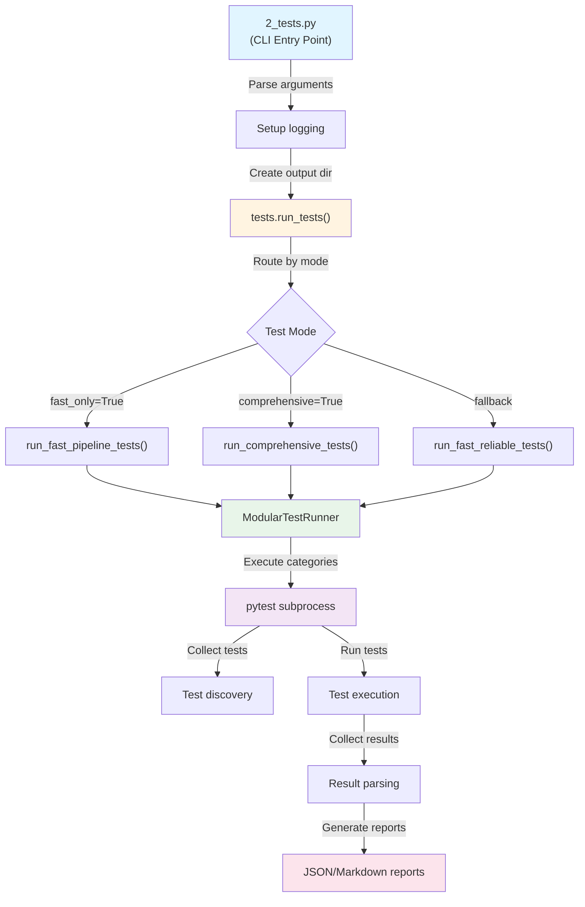
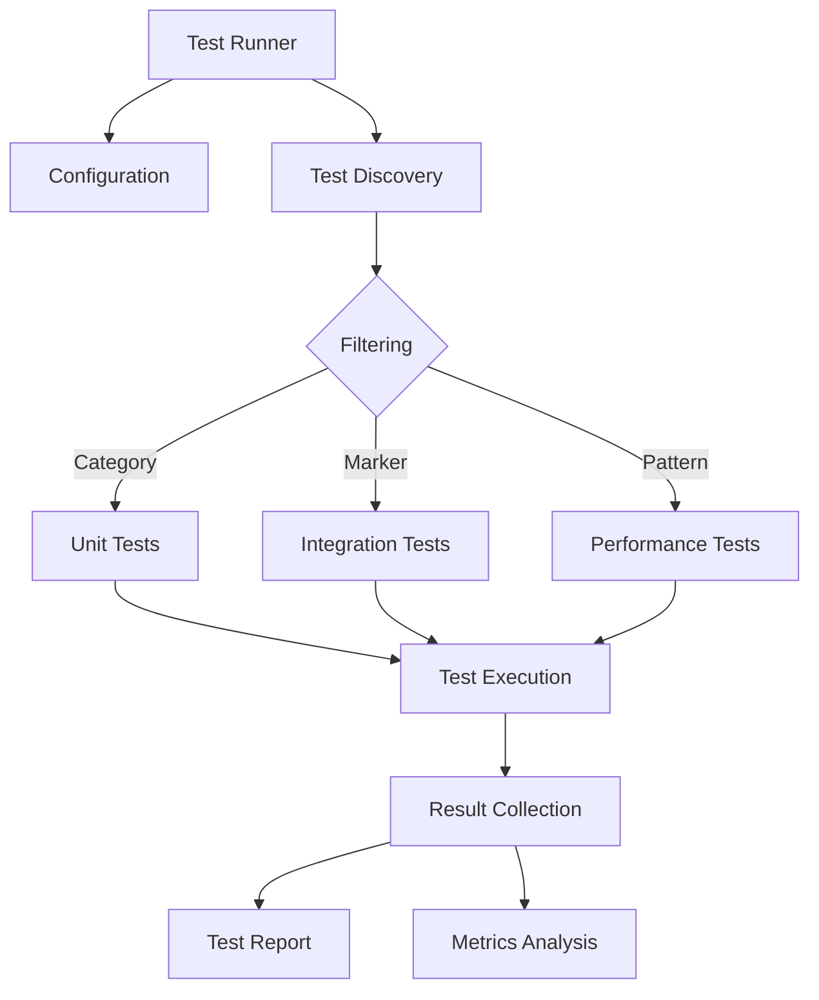

# Test Infrastructure

This directory contains the comprehensive test suite for the GNN Processing Pipeline. The test infrastructure has been completely refactored to follow a modular, organized structure that provides comprehensive coverage for all modules.

## Architecture

The test infrastructure follows the **thin orchestrator pattern**, where `2_tests.py` acts as a thin wrapper that delegates all core functionality to the `tests/` module.

### Component Overview

**2_tests.py** (Thin Orchestrator):
- Handles command-line argument parsing
- Sets up logging and visual output
- Manages output directory creation
- Delegates to `tests.run_tests()` from `tests/__init__.py`
- Returns standardized exit codes (0=success, 1=failure)

**runner.py** (Core Implementation):
- Contains all test execution logic
- Provides multiple execution modes: fast, comprehensive, reliable
- Implements `ModularTestRunner` for category-based execution
- Handles resource monitoring, timeouts, and error recovery
- Generates comprehensive test reports

**test_utils.py** (Shared Utilities):
- Provides test fixtures and helper functions
- Defines test categories, markers, and configuration
- Provides test data creation utilities
- Used by both test files and the runner

**conftest.py** (Pytest Configuration):
- Defines pytest fixtures available to all tests
- Configures pytest markers
- Handles test environment setup/teardown
- Provides shared test utilities

### Execution Flow



## Test File Structure

### Module-Based Naming Convention

All test files follow the pattern:
- `test_MODULENAME_overall.py` - Comprehensive module coverage
- `test_MODULENAME_area1.py` - Specific module areas
- `test_MODULENAME_area2.py` - Additional specialized areas

### Current Test Files

#### Core Module Tests
- `test_gnn_overall.py` - Comprehensive GNN module testing
- `test_gnn_parsing.py` - GNN parsing and discovery tests
- `test_gnn_validation.py` - GNN validation and consistency tests
- `test_gnn_processing.py` - GNN processing and serialization tests
- `test_gnn_integration.py` - GNN integration tests

#### Render Module Tests
- `test_render_overall.py` - Comprehensive render module testing
- `test_render_integration.py` - Render integration tests
- `test_render_performance.py` - Render performance tests

#### MCP Module Tests
- `test_mcp_overall.py` - Comprehensive MCP module testing
- `test_mcp_tools.py` - MCP tool execution tests
- `test_mcp_transport.py` - MCP transport layer tests
- `test_mcp_integration.py` - MCP integration tests
- `test_mcp_performance.py` - MCP performance tests

#### Audio Module Tests
- `test_audio_overall.py` - Comprehensive audio module testing
- `test_audio_sapf.py` - SAPF audio generation tests
- `test_audio_generation.py` - Audio generation tests
- `test_audio_integration.py` - Audio integration tests

#### Visualization Module Tests
- `test_visualization_overall.py` - Comprehensive visualization module testing
- `test_visualization_matrices.py` - Matrix visualization tests
- `test_visualization_ontology.py` - Ontology visualization tests

#### Pipeline Module Tests
- `test_pipeline_overall.py` - Comprehensive pipeline module testing
- `test_pipeline_integration.py` - Pipeline integration tests
- `test_pipeline_orchestration.py` - Pipeline orchestration tests
- `test_pipeline_performance.py` - Pipeline performance tests
- `test_pipeline_recovery.py` - Pipeline recovery tests
- `test_pipeline_scripts.py` - Pipeline script tests
- `test_pipeline_infrastructure.py` - Pipeline infrastructure tests
- `test_pipeline_functionality.py` - Pipeline functionality tests

#### Export Module Tests
- `test_export_overall.py` - Comprehensive export module testing

#### Execute Module Tests
- `test_execute_overall.py` - Comprehensive execute module testing

#### LLM Module Tests
- `test_llm_overall.py` - Comprehensive LLM module testing

#### Ontology Module Tests
- `test_ontology_overall.py` - Comprehensive ontology module testing

#### Website Module Tests
- `test_website_overall.py` - Comprehensive website module testing

#### Report Module Tests
- `test_report_overall.py` - Comprehensive report module testing
- `test_report_generation.py` - Report generation tests
- `test_report_integration.py` - Report integration tests
- `test_report_formats.py` - Report format tests

#### Environment Module Tests
- `test_environment_overall.py` - Comprehensive environment module testing
- `test_environment_dependencies.py` - Environment dependency tests
- `test_environment_integration.py` - Environment integration tests
- `test_environment_python.py` - Python environment tests
- `test_environment_system.py` - System environment tests

#### Comprehensive Tests
- `test_comprehensive_api.py` - Comprehensive API testing
- `test_core_modules.py` - Core module integration tests
- `test_fast_suite.py` - Fast test suite
- `test_main_orchestrator.py` - Main orchestrator tests
- `test_coverage_overall.py` - Coverage tests
- `test_performance_overall.py` - Performance tests
- `test_unit_overall.py` - Unit tests

## Test Runner Configuration

The test runner (`runner.py`) is configured with comprehensive test categories:

```python
MODULAR_TEST_CATEGORIES = {
    "gnn": {
        "name": "GNN Module Tests",
        "description": "GNN processing and validation tests",
        "files": ["test_gnn_overall.py", "test_gnn_parsing.py", "test_gnn_validation.py", 
                  "test_gnn_processing.py", "test_gnn_integration.py"],
        "markers": [],
        "timeout_seconds": 120,
        "max_failures": 8,
        "parallel": True
    },
    # ... additional categories for all modules
}
```

## Test Execution



### Running Tests

#### Fast Tests (Default - Pipeline Mode)
```bash
# Run fast tests only (default for pipeline)
python src/2_tests.py --fast-only --verbose

# Or simply (fast-only is default)
python src/2_tests.py --verbose
```

#### Comprehensive Tests
```bash
# Run all tests including slow and performance tests
python src/2_tests.py --comprehensive --verbose
```

#### Direct Test Runner
```bash
# Run fast test suite directly
python src/tests/run_fast_tests.py
```

### Environment Variables

The test runner supports several environment variables for configuration:

#### `SKIP_TESTS_IN_PIPELINE`
Skip all tests during pipeline execution (for faster pipeline runs).
```bash
export SKIP_TESTS_IN_PIPELINE=1
python src/main.py  # Tests will be skipped
```

#### `FAST_TESTS_TIMEOUT`
Override the default timeout for fast tests (default: 600 seconds = 10 minutes).
```bash
export FAST_TESTS_TIMEOUT=300  # 5 minutes
python src/2_tests.py --fast-only
```

#### Usage Examples
```bash
# Skip tests in pipeline for faster execution
SKIP_TESTS_IN_PIPELINE=1 python src/main.py

# Run fast tests with custom timeout
FAST_TESTS_TIMEOUT=180 python src/2_tests.py --fast-only

# Run comprehensive tests with verbose output
python src/2_tests.py --comprehensive --verbose
```

## Test Utilities

### Shared Test Utilities (`src/utils/test_utils.py`)
- `TEST_CATEGORIES` - Test category definitions
- `TEST_STAGES` - Test execution stages
- `TEST_CONFIG` - Test configuration
- `is_safe_mode()` - Safe mode detection
- `setup_test_environment()` - Test environment setup
- `create_sample_gnn_content()` - Sample GNN content creation
- `performance_tracker()` - Performance tracking decorator
- `get_memory_usage()` - Memory usage monitoring
- `assert_file_exists()` - File existence assertions
- Report generation functions

### Test Fixtures (`conftest.py`)
- `project_root` - Project root directory
- `src_dir` - Source directory
- `test_dir` - Test directory
- `safe_filesystem` - Safe filesystem operations
- `sample_gnn_files` - Sample GNN files
- `isolated_temp_dir` - Isolated temporary directory
- `comprehensive_test_data` - Comprehensive test data

## Test Markers

### Available Markers
- `@pytest.mark.unit` - Unit tests
- `@pytest.mark.integration` - Integration tests
- `@pytest.mark.slow` - Slow tests
- `@pytest.mark.safe_to_fail` - Tests that can safely fail
- `@pytest.mark.fast` - Fast tests

### Running Tests by Marker
```bash
# Run only unit tests
pytest -m unit

# Run only integration tests
pytest -m integration

# Run fast tests only
pytest -m fast

# Exclude slow tests
pytest -m "not slow"
```

## Test Categories

### Core Module Tests
- **GNN Module**: Processing, validation, parsing, integration
- **Render Module**: Code generation, multiple targets, performance
- **MCP Module**: Model Context Protocol, tools, transport, integration
- **Audio Module**: SAPF, generation, integration
- **Visualization Module**: Graphs, matrices, ontology, interactive

### Infrastructure Module Tests
- **Pipeline Module**: Orchestration, steps, configuration, performance, recovery
- **Export Module**: Multi-format export (JSON, XML, GraphML, GEXF, Pickle)
- **Execute Module**: Execution and simulation
- **LLM Module**: LLM integration and analysis
- **Ontology Module**: Ontology processing and validation
- **Website Module**: Website generation
- **Report Module**: Report generation and formatting
- **Environment Module**: Environment setup and validation

### Specialized Module Tests
- **Type Checker Module**: Type checking and validation
- **Validation Module**: Validation and consistency
- **Model Registry Module**: Model registry and versioning
- **Analysis Module**: Analysis and statistical
- **Integration Module**: System integration
- **Security Module**: Security validation
- **Research Module**: Research tools
- **ML Integration Module**: Machine learning integration
- **Advanced Visualization Module**: Advanced visualization

### Comprehensive Tests
- **Comprehensive API**: Complete API testing
- **Core Modules**: Core module integration
- **Fast Suite**: Fast execution tests
- **Main Orchestrator**: Main orchestrator functionality
- **Coverage**: Code coverage tests
- **Performance**: Performance and benchmarking
- **Unit**: Basic unit tests

## Test Execution Features

### Resource Monitoring
- Memory usage tracking
- CPU usage monitoring
- Timeout handling
- Resource limits

### Parallel Execution
- Category-based parallel execution
- Configurable parallelization
- Resource-aware scheduling

### Error Handling
- Graceful failure handling
- Error reporting and logging
- Recovery mechanisms
- Safe-to-fail test execution

### Reporting
- Comprehensive test reports
- Performance metrics
- Coverage analysis
- Error summaries

## Test Organization Patterns

### Naming Conventions

Test files follow a consistent naming pattern:
- `test_MODULENAME_overall.py` - Comprehensive module tests (required for each module)
- `test_MODULENAME_area.py` - Specific area tests (e.g., `test_gnn_parsing.py`, `test_gnn_validation.py`)
- `test_MODULENAME_integration.py` - Integration tests for the module
- `test_MODULENAME_performance.py` - Performance tests for the module

### Test Markers

Use pytest markers to categorize tests:

```python
@pytest.mark.fast  # Quick tests (< 1 second)
def test_quick_functionality():
    pass

@pytest.mark.slow  # Slow tests (> 10 seconds)
def test_complex_scenario():
    pass

@pytest.mark.integration  # Integration tests
def test_module_integration():
    pass

@pytest.mark.safe_to_fail  # Tests that can fail without breaking pipeline
def test_optional_feature():
    pass
```

### Adding New Test Categories

To add a new test category to `MODULAR_TEST_CATEGORIES` in `runner.py`:

```python
MODULAR_TEST_CATEGORIES["new_module"] = {
    "name": "New Module Tests",
    "description": "Tests for the new module functionality",
    "files": [
        "test_new_module_overall.py",
        "test_new_module_integration.py"
    ],
    "markers": ["new_module"],  # Optional pytest markers to filter
    "timeout_seconds": 120,      # Maximum execution time
    "max_failures": 8,           # Stop after N failures
    "parallel": True              # Allow parallel execution
}
```

### Creating New Test Files

Example test file structure:

```python
# src/tests/test_new_module_overall.py
"""Comprehensive tests for the new module."""

import pytest
from pathlib import Path
from utils.test_utils import create_sample_gnn_content, assert_file_exists

@pytest.mark.fast
def test_new_module_basic():
    """Test basic functionality."""
    # Test implementation using real methods
    result = process_module(data)
    assert result is not None

@pytest.mark.slow
def test_new_module_complex():
    """Test complex scenarios."""
    # Test implementation
    pass

@pytest.mark.integration
def test_new_module_integration():
    """Test integration with other modules."""
    # Test implementation
    pass
```

## Best Practices

### Test Organization
1. **Module-Based Structure**: Each module has its own test files
2. **Comprehensive Coverage**: Each module has an `_overall.py` test file
3. **Specialized Testing**: Additional test files for specific areas
4. **Integration Testing**: Cross-module integration tests

### Test Writing
1. **No Mocks**: Do not use mocking frameworks or monkeypatches to simulate behavior. Execute real methods and code paths.
2. **Import Error Handling**: Wrap imports in try/except blocks; skip if optional deps missing.
3. **Comprehensive Assertions**: Test both success and failure cases against real artifacts.
4. **Performance Monitoring**: Use performance tracking for slow operations

### Test Execution
1. **Category-Based**: Run tests by module category
2. **Parallel Execution**: Use parallel execution for faster results
3. **Resource Monitoring**: Monitor resource usage during execution
4. **Error Recovery**: Handle errors gracefully with fallback mechanisms

## Troubleshooting

### Common Issues and Solutions

#### Issue: Tests Timeout
**Symptoms**: Tests fail with timeout errors
**Solutions**:
- Increase timeout: `export FAST_TESTS_TIMEOUT=900` (15 minutes)
- Run fast tests only: `python src/2_tests.py --fast-only`
- Skip tests in pipeline: `export SKIP_TESTS_IN_PIPELINE=1`

#### Issue: Collection Errors
**Symptoms**: `ERROR collecting` messages, import errors
**Solutions**:
- Check for missing dependencies: `pip install -r requirements.txt`
- Verify Python path includes `src/` directory
- Check for syntax errors in test files
- Review error messages for specific import failures

#### Issue: Tests Fail to Run
**Symptoms**: No tests collected, exit code 5
**Solutions**:
- Verify test files follow naming convention: `test_*.py`
- Check that test functions are named with `test_` prefix
- Ensure test files are in `src/tests/` directory
- Check pytest is installed: `pip install pytest`

#### Issue: Memory Errors
**Symptoms**: Out of memory errors during test execution
**Solutions**:
- Run tests sequentially instead of parallel
- Reduce number of tests: use `--fast-only` flag
- Increase system memory or use swap space
- Check for memory leaks in test code

#### Issue: Slow Test Execution
**Symptoms**: Tests take too long to complete
**Solutions**:
- Use `--fast-only` flag to skip slow tests
- Mark slow tests with `@pytest.mark.slow` and exclude: `pytest -m "not slow"`
- Run specific test categories instead of all tests
- Use parallel execution (if not already enabled)

#### Issue: Import Errors in Tests
**Symptoms**: `ImportError` or `ModuleNotFoundError` in test files
**Solutions**:
- Ensure `src/` is in Python path
- Check that modules are properly installed
- Verify relative imports are correct
- Use `sys.path.insert(0, str(SRC_DIR))` if needed

### Getting Help

If issues persist:
1. Check test output files in `output/2_tests_output/`
2. Review `pytest_comprehensive_output.txt` for detailed error messages
3. Check `test_execution_report.json` for execution summary
4. Verify environment variables are set correctly
5. Ensure all dependencies are installed

## Current Status

### Test Coverage
- **423 test items** collected
- **Comprehensive module coverage** for all major modules
- **Specialized test areas** for specific functionality
- **Integration tests** for cross-module functionality

### Test Infrastructure
- **Modular test runner** with category-based execution
- **Resource monitoring** and timeout handling
- **Parallel execution** support
- **Comprehensive reporting** and error handling

### Module Coverage
- ✅ GNN Module - Complete coverage
- ✅ Render Module - Complete coverage
- ✅ MCP Module - Complete coverage
- ✅ Audio Module - Complete coverage
- ✅ Visualization Module - Complete coverage
- ✅ Pipeline Module - Complete coverage
- ✅ Export Module - Complete coverage
- ✅ Execute Module - Complete coverage
- ✅ LLM Module - Complete coverage
- ✅ Ontology Module - Complete coverage
- ✅ Website Module - Complete coverage
- ✅ Report Module - Complete coverage
- ✅ Environment Module - Complete coverage

## Future Enhancements

### Planned Improvements
1. **Additional Module Tests**: Complete coverage for remaining modules
2. **Performance Benchmarking**: Enhanced performance testing
3. **Coverage Analysis**: Improved code coverage tracking
4. **Automated Testing**: CI/CD integration
5. **Test Documentation**: Enhanced test documentation

### Module Expansion
- Type Checker Module tests
- Validation Module tests
- Model Registry Module tests
- Analysis Module tests
- Integration Module tests
- Security Module tests
- Research Module tests
- ML Integration Module tests
- Advanced Visualization Module tests

This test infrastructure provides a solid foundation for comprehensive testing of the GNN Processing Pipeline, with modular organization, parallel execution, and comprehensive coverage of all major components. 

## References

- Project overview: ../../README.md
- Comprehensive docs: ../../DOCS.md
- Architecture guide: ../../ARCHITECTURE.md
- Pipeline details: ../../doc/pipeline/README.md