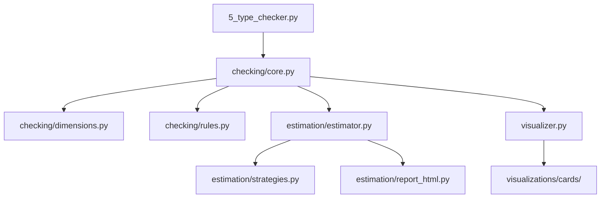

# Type Checker Module

This module provides the rigorous, integrated validation layer powering the GNN zero-mock processing pipeline. It evaluates syntax structures, maps multidimensional parameters across generative mathematical bounds, performs full structural cross-validation, and renders executive dashboard trading cards evaluating physical resource estimations natively.

## Structural Hierarchy
The Type Checker subsystem was structurally unified in Version 1.6.0, reorganizing the logic into clean subpackages for checking and resource estimation while maintaining backward compatibility through thin delegating modules.



### `checking/` (Core Validation Layer)
The core GNN validation subsystem.
- **`core.py`**: The central `GNNTypeChecker` orchestrator class evaluated directly by the main pipeline flow.
- **`rules.py`**: Canonical valid types and syntactical bounds.
- **`dimensions.py`**: Dimensionality extraction and POMDP matrix constraint checking.

### `estimation/` (Resource Estimation Subsystem)
- **`estimator.py`**: Core `GNNResourceEstimator` class that evaluates models and generates structured metrics.
- **`strategies.py`**: Pure, math-heavy resource algorithms projecting hardware requirements (Memory MB bounds, FLOPS scaling, parameter tracking).
- **`report_html.py` / `report_markdown.py`**: Decoupled presentation formatting.

### `visualizer.py` (Executive Graphic Abstract Layer)
A bespoke analytical graphic utility rendering four distinct, completely zero-mock visual abstractions straight from the GNN evaluation metrics:
1.  **Validity Mosaics**: Heat-mapped Grids classifying model warnings vs critical errors system-wide.
2.  **Type Pie Trackers**: Aggregated representations showing overall percentage of active framework distributions (e.g., Categorical, Floats, Distributions).
3.  **Dimensional Radars**: Measuring raw alignment maps between model matrix shapes globally.
4.  **Model Baseball Cards**: Generating hyper-isolated trading-cards per model logging explicit structural complexities and validation scores (Located at `output/5_type_checker_output/visualizations/cards/`).

## Execution
```bash
# General invocation via master orchestration
python src/main.py --only-steps=5 --verbose

# Isolated explicit step targeting
python src/5_type_checker.py --target-dir input/gnn_files --output-dir output/5_type_checker_output

# Generate standalone resource estimates
python src/5_type_checker.py --estimate-resources
```

## Legacy Deprecations
> [!NOTE]
> `processor.py`, `resource_estimator.py`, and `estimation_strategies.py` have been converted into thin delegation layers for backward compatibility. Import from the `.checking` and `.estimation` subpackages for new development.
