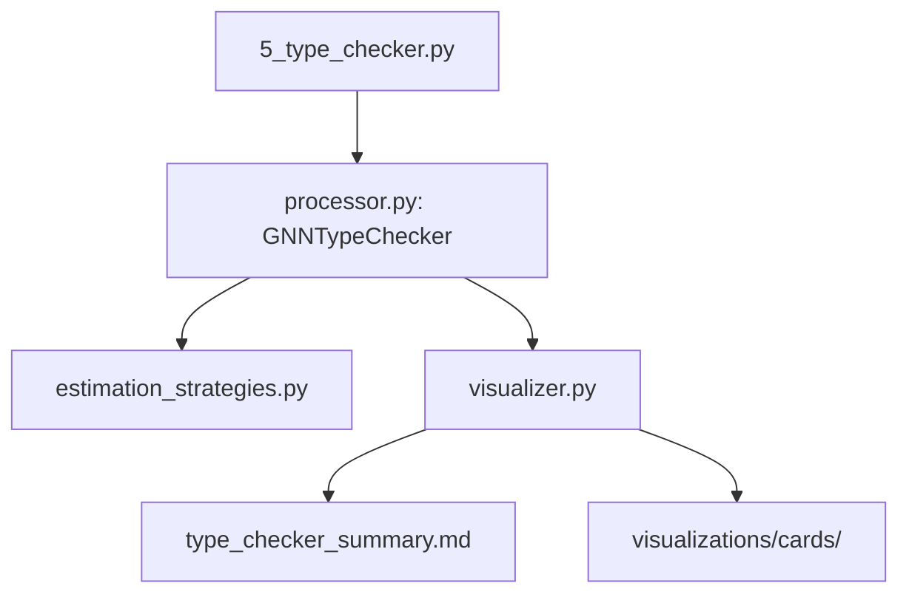

# Type Checker Module

This module provides the rigorous, integrated validation layer powering the GNN zero-mock processing pipeline. It evaluates syntax structures, maps multidimensional parameters across generative mathematical bounds, performs full structural cross-validation, and renders executive dashboard trading cards evaluating physical resource estimations natively.

## Structural Hierarchy
The Type Checker subsystem was structurally unified in Version 1.1.4, deprecating isolated redundancy and consolidating logic natively into the production pipeline.



### `processor.py` (Main Pipeline Dispatcher)
The central `GNNTypeChecker` orchestrator class evaluated directly by the main pipeline flow. It scans all nested GNN files via recursive mapping, extracts semantic type arrays like `Categorical` or `POMDP` nodes, checks the syntactical bounds of connections, and passes the entire payload into the downstream resource and visual evaluators seamlessly.

### `estimation_strategies.py` (Core Math & Computing Layer)
Isolated rigorous estimators projecting precisely how expensive a model is to run on real hardware (e.g. tracking MB memory bounds, matrix operation capacities, and nonlinear functions tracking FLOPS). Directly connected to the `processor.py` layer to assign realistic resource bounds instantly.

### `visualizer.py` (Executive Graphic Abstract Layer)
A bespoke analytical graphic utility rendering four distinct, completely zero-mock visual abstractions straight from the GNN evaluation metrics:
1.  **Validity Mosaics**: Heat-mapped Grids classifying model warnings vs critical errors system-wide.
2.  **Type Pie Trackers**: Aggregated representations showing overall percentage of active framework distributions (e.g., Categorical, Floats, Distributions).
3.  **Dimensional Radars**: Measuring raw alignment maps between model matrix shapes globally.
4.  **Model Baseball Cards**: Generating hyper-isolated trading-cards per model logging explicit structural complexities and validation scores (Located at `output/5_type_checker_output/visualizations/cards/`).

## Execution
```bash
# General invocation via master orchestration
python src/main.py --only-steps=5 --verbose

# Isolated explicit step targeting
python src/5_type_checker.py --target-dir input/gnn_files --output-dir output/5_type_checker_output
```

## Legacy Deprecations
> [!NOTE]
> During structural unification, isolated legacy testing structures representing `checker.py` were deprecated entirely. The test suite (`src/tests/test_type_checker_overall.py`) exclusively targets the real GNN active production layer `processor.py`.
