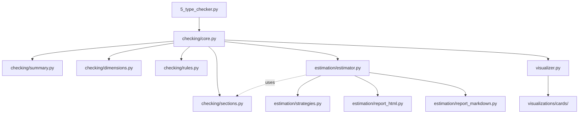

# Type Checker Module

This module provides the rigorous, integrated validation layer powering the GNN processing pipeline. It evaluates syntax structures, maps multidimensional parameters across generative mathematical bounds, performs full structural cross-validation, and renders executive dashboard trading cards evaluating physical resource estimations natively.

## Structural Hierarchy
The Type Checker subsystem is organized into clean subpackages for checking and resource estimation, with top-level facade modules for pipeline and CLI entry points.


```mermaid
graph TD
    Pipeline[5_type_checker.py] --> Core[checking/core.py]
    Core --> Sections[checking/sections.py]
    Core --> Summary[checking/summary.py]
    Core --> Dim[checking/dimensions.py]
    Core --> Rules[checking/rules.py]
    Core --> EstSub[estimation/estimator.py]
    EstSub --> EstStrat[estimation/strategies.py]
    EstSub --> EstHtml[estimation/report_html.py]
    EstSub --> EstMd[estimation/report_markdown.py]
    EstSub -. uses .-> Sections
    Core --> MatrixOutput[visualizer.py]
    MatrixOutput --> Cards[visualizations/cards/]
```

### `checking/` (Core Validation Layer)
The core GNN validation subsystem.
- **`core.py`**: The central `GNNTypeChecker` orchestrator class evaluated directly by the main pipeline flow. Owns `validate_content` (pure, no filesystem), `validate_single_gnn_file`, and `validate_gnn_files` (directory run that writes `type_check_results.json`, `type_check_summary.md`, and `type_check_summary.json`).
- **`sections.py`**: Pure, section-scoped GNN content extraction (`extract_markdown_section`, `connection_group`, `parse_resource_connections`, `section_presence`, `detect_time_dynamics`) shared by the checker and the estimator so connection operators appearing in prose are never mistaken for real edges.
- **`summary.py`**: `ValidationSummary` TypedDict + `summarize_type_check_results` — the typed aggregation of a directory run, written to `type_check_summary.json`.
- **`rules.py`**: Canonical valid types and syntactical bounds.
- **`dimensions.py`**: Dimensionality extraction and POMDP matrix constraint checking (including B-orientation verdicts).

### `estimation/` (Resource Estimation Subsystem)
- **`estimator.py`**: Core `GNNResourceEstimator` class that evaluates models and generates structured metrics; classifies the `## Time` section as Static/Dynamic/Hierarchical.
- **`strategies.py`**: Pure, math-heavy resource algorithms projecting hardware requirements (Memory MB bounds, FLOPS scaling, parameter tracking).
- **`report_html.py` / `report_markdown.py`**: Decoupled presentation formatting.

### `visualizer.py` (Executive Graphic Abstract Layer)
A bespoke analytical graphic utility rendering four distinct visual abstractions straight from the GNN evaluation metrics:
1.  **Validity Mosaics**: Heat-mapped Grids classifying model warnings vs critical errors system-wide.
2.  **Type Pie Trackers**: Aggregated representations showing overall percentage of active framework distributions (e.g., Categorical, Floats, Distributions).
3.  **Dimensional Radars**: Measuring raw alignment maps between model matrix shapes globally.
4.  **Model Baseball Cards**: Generating hyper-isolated trading-cards per model logging explicit structural complexities and validation scores (Located at `output/5_type_checker_output/visualizations/cards/`).

## Execution
```bash
# General invocation via master orchestration
python src/main.py --only-steps=5 --verbose

# Isolated explicit step targeting
python src/5_type_checker.py --target-dir input/gnn_files --output-dir output/5_type_checker_output

# Strict mode (promotes B-orientation contradictions to errors)
python src/5_type_checker.py --target-dir input/gnn_files --strict

# Generate standalone resource estimates
python src/5_type_checker.py --estimate-resources
```

## Public Facades

`processor.py`, `resource_estimator.py`, and `estimation_strategies.py` expose current public imports while delegating implementation to the `.checking` and `.estimation` subpackages. The package root (`__init__.py`) exports `GNNTypeChecker`, `estimate_file_resources`, `extract_gnn_dimensions`, `validate_dimension_compatibility`, `summarize_type_check_results`, and the `ValidationSummary` / `ResourceEstimate` TypedDicts.
