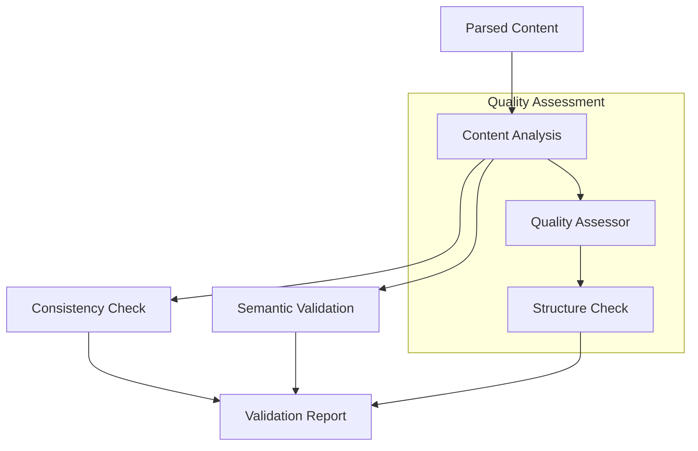
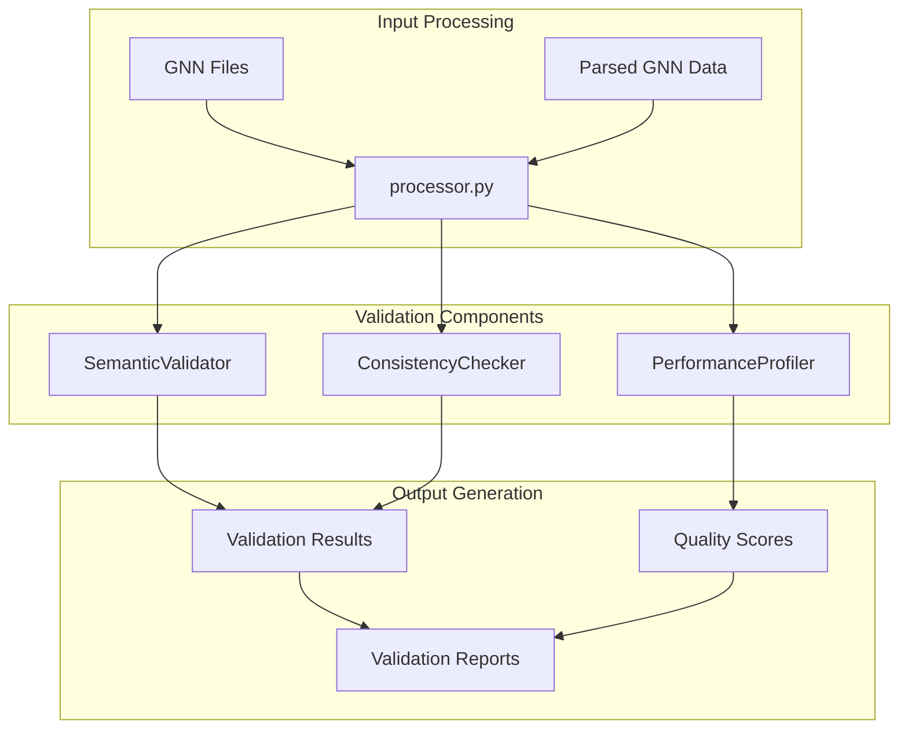
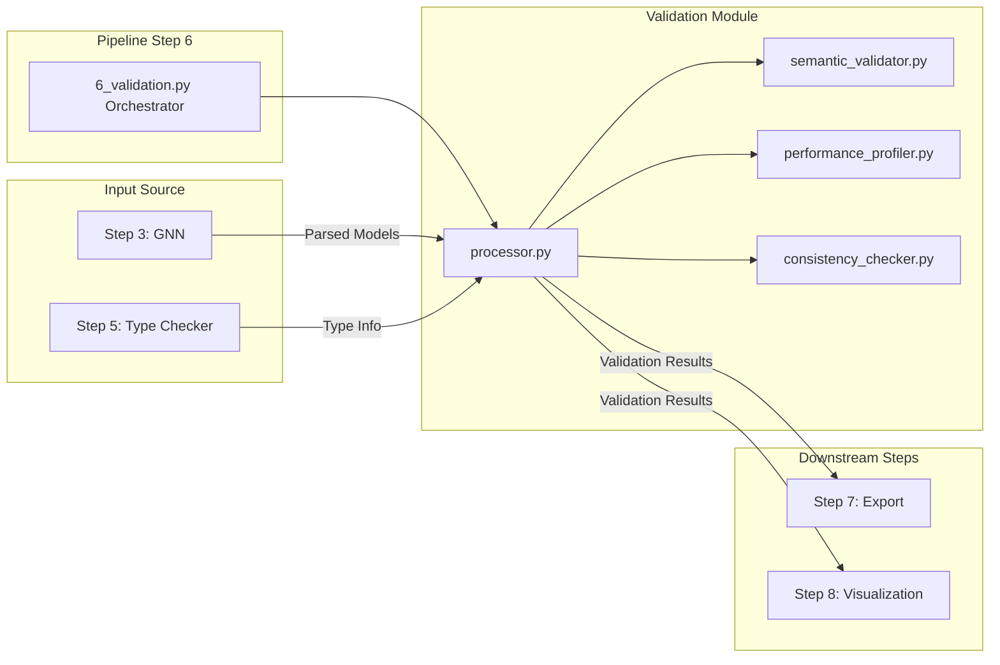

# Validation Module

This module provides comprehensive validation capabilities for GNN models, including consistency checking, semantic validation, and quality assessment.

## Module Structure

```
src/validation/
├── __init__.py                    # Module initialization, exports, and process_validation orchestrator
├── README.md                      # This documentation
├── AGENTS.md                      # Agent scaffolding documentation
├── SPEC.md                        # Module specification
├── PAI.md                         # Pipeline integration documentation
├── consistency_checker.py         # Consistency checking (naming, style, structure, references)
├── semantic_validator.py          # Semantic validation (structure, state space, connections, math)
├── performance_profiler.py        # Performance profiling (complexity, memory, parallelization)
└── mcp.py                         # Model Context Protocol integration
```

### Validation Process



### Validation Architecture



### Module Integration Flow



## Core Components

### Orchestrator Function

#### `process_validation(target_dir: Path, output_dir: Path, verbose: bool = False, **kwargs) -> bool`

Main pipeline orchestrator (called by `6_validation.py`). Reads GNN results JSON from step 3, then runs all three validators on each parsed file.

**Workflow:**

1. Loads `gnn_processing_results.json` from step 3 output directory
2. For each parsed file, runs `process_semantic_validation()`, `profile_performance()`, and `check_consistency()`
3. Calculates average scores and writes `validation_results.json` and `validation_summary.json`

**Returns:** `bool` — `True` if at least one file validated successfully

**Location:** `__init__.py`

### SemanticValidator (`semantic_validator.py`)

#### `SemanticValidator(validation_level: str = "standard")`

Rule-based validator with 7 validation rules across 4 levels (basic, standard, strict, research).

**Validation Rules:**

- `_validate_basic_structure` (level 1) — ModelName, StateSpaceBlock presence
- `_validate_state_space_definitions` (level 1) — dimension parsing
- `_validate_connection_integrity` (level 2) — source/target refs
- `_validate_mathematical_consistency` (level 2) — matrix dims, probability sums
- `_validate_active_inference_principles` (level 3) — FEP terms
- `_validate_causal_relationships` (level 3) — cycle detection
- `_validate_advanced_mathematical_properties` (level 4) — KL divergence

#### `process_semantic_validation(model_data, **kwargs) -> Dict[str, Any]`

Entry point — accepts file path, Path, or dict. Returns `{valid, errors, warnings, semantic_score}`.

### PerformanceProfiler (`performance_profiler.py`)

#### `PerformanceProfiler()`

Estimates computational complexity, memory usage, and parallelization potential from GNN content.

**Metrics Calculated:**

- State block count, dimension statistics, estimated memory (MB)
- Computational complexity class (O(1) through O(n³)+)
- Bottleneck block identification
- Parallelization potential and GPU/distributed amenability

#### `profile_performance(model_path) -> Dict[str, Any]`

Entry point — accepts file path, Path, or dict. Returns `{metrics, warnings, performance_score}`.

### ConsistencyChecker (`consistency_checker.py`)

#### `ConsistencyChecker()`

Checks naming conventions, style consistency, structural integrity, and reference consistency.

**Checks Performed:**

- `_check_naming_conventions` — camelCase vs snake_case mix, duplicates, short names
- `_check_style_consistency` — indentation patterns, block formatting, field ordering
- `_check_structural_integrity` — balanced braces, empty blocks, required fields
- `_check_reference_consistency` — invalid refs, isolated blocks, circular dependencies

#### `check_consistency(model_data) -> Dict[str, Any]`

Entry point — accepts file path, Path, or dict. Returns `{consistent, warnings, consistency_score}`.

## Usage Examples

### Pipeline Orchestration

```python
from validation import process_validation
from pathlib import Path

# Run full validation pipeline (requires step 3 output)
success = process_validation(
    target_dir=Path("models/"),
    output_dir=Path("output/6_validation_output/"),
    verbose=True
)
print(f"Validation {'succeeded' if success else 'failed'}")
```

### Semantic Validation

```python
from validation import process_semantic_validation

# Validate from file path
result = process_semantic_validation("model.gnn", validation_level="strict")
print(f"Valid: {result['valid']}, Score: {result['semantic_score']:.2f}")
print(f"Errors: {result['errors']}")
print(f"Warnings: {result['warnings']}")

# Validate from dict (e.g., parsed GNN data)
result = process_semantic_validation({"raw_sections": {"ModelName": "Test", "StateSpaceBlock": "..."}})
```

### Performance Profiling

```python
from validation import profile_performance

result = profile_performance("model.gnn")
print(f"Memory estimate: {result['metrics']['estimated_memory_mb']:.2f} MB")
print(f"Complexity: {result['metrics']['computational_complexity']['complexity_class']}")
print(f"Score: {result['performance_score']:.2f}")
```

### Consistency Checking

```python
from validation import check_consistency

result = check_consistency("model.gnn")
print(f"Consistent: {result['consistent']}, Score: {result['consistency_score']:.2f}")
print(f"Warnings: {result['warnings']}")
```

### Standalone Class Usage

```python
from validation import SemanticValidator, ConsistencyChecker, PerformanceProfiler

# Direct class usage with content strings
validator = SemanticValidator(validation_level="research")
result = validator.validate(gnn_content)  # Returns {is_valid, errors, warnings}

checker = ConsistencyChecker()
result = checker.check(gnn_content)  # Returns {is_consistent, warnings, checks}

profiler = PerformanceProfiler()
result = profiler.profile(gnn_content)  # Returns {metrics, warnings}
```

## Integration with Pipeline

### Pipeline Step 6: Validation Processing

The `process_validation()` orchestrator is called by `6_validation.py`. It:

1. Reads `gnn_processing_results.json` from step 3 output
2. Iterates over each successfully parsed file
3. Runs semantic validation, performance profiling, and consistency checking
4. Writes results to the step 6 output directory

### Output Structure

```
output/6_validation_output/
├── validation_results.json        # Per-file validation details
└── validation_summary.json        # Aggregated scores and counts
```

## Validation Features

### Consistency Checking

- **Variable Consistency**: Checking variable definitions and usage
- **Connection Consistency**: Validating connection relationships
- **Parameter Consistency**: Verifying parameter consistency
- **Structure Consistency**: Ensuring structural consistency
- **Cross-reference Consistency**: Validating cross-references

### Semantic Validation

- **Meaning Consistency**: Checking semantic meaning consistency
- **Logic Consistency**: Validating logical consistency
- **Context Validation**: Verifying context appropriateness
- **Relationship Analysis**: Analyzing semantic relationships
- **Interpretation Validation**: Validating model interpretations

### Quality Assessment

- **Completeness Assessment**: Evaluating model completeness
- **Correctness Evaluation**: Assessing model correctness
- **Consistency Scoring**: Scoring model consistency
- **Clarity Assessment**: Evaluating model clarity
- **Maintainability Evaluation**: Assessing maintainability

### Error Detection

- **Consistency Error Detection**: Detecting consistency errors
- **Semantic Error Detection**: Detecting semantic errors
- **Quality Issue Detection**: Detecting quality issues
- **Structure Error Detection**: Detecting structure errors
- **Cross-reference Error Detection**: Detecting cross-reference errors

## Configuration Options

### Validation Settings

```python
# Validation configuration
config = {
    'consistency_checking_enabled': True,  # Enable consistency checking
    'semantic_validation_enabled': True,   # Enable semantic validation
    'quality_assessment_enabled': True,    # Enable quality assessment
    'error_detection_enabled': True,       # Enable error detection
    'structure_validation_enabled': True,  # Enable structure validation
    'auto_fix_enabled': False             # Enable automatic error fixing
}
```

### Quality Settings

```python
# Quality configuration
quality_config = {
    'completeness_threshold': 0.8,        # Completeness threshold
    'correctness_threshold': 0.9,         # Correctness threshold
    'consistency_threshold': 0.85,        # Consistency threshold
    'clarity_threshold': 0.75,            # Clarity threshold
    'maintainability_threshold': 0.8      # Maintainability threshold
}
```

## Error Handling

All entry-point functions use try/except blocks internally and return error dicts with `fallback: True` instead of raising exceptions:

```python
result = process_semantic_validation("nonexistent.gnn")
if result.get("fallback"):
    print(f"Error: {result['error']}")
else:
    print(f"Valid: {result['valid']}")
```

The `process_validation()` orchestrator catches all exceptions per-file, logs errors, and continues processing remaining files.

## Performance Optimization

### Validation Optimization

- **Caching**: Cache validation results
- **Parallel Processing**: Parallel validation processing
- **Incremental Validation**: Incremental validation updates
- **Optimized Algorithms**: Optimize validation algorithms

### Consistency Optimization

- **Consistency Caching**: Cache consistency results
- **Parallel Consistency**: Parallel consistency checking
- **Incremental Consistency**: Incremental consistency updates
- **Optimized Consistency**: Optimize consistency algorithms

### Quality Optimization

- **Quality Caching**: Cache quality assessment results
- **Parallel Quality**: Parallel quality assessment
- **Incremental Quality**: Incremental quality updates
- **Optimized Quality**: Optimize quality assessment algorithms

## Testing

Validation module tests are located in `src/tests/test_comprehensive_api.py` and cover:

- `process_semantic_validation()` with file path and dict inputs
- `profile_performance()` with file path and dict inputs
- `check_consistency()` with file path and dict inputs
- `process_validation()` orchestrator integration
- Module import and feature flag verification

## Dependencies

### Required Dependencies

- **pathlib**: Path handling
- **json**: JSON data handling
- **logging**: Logging functionality
- **typing**: Type hints and annotations

### Optional Dependencies

- **numpy**: Numerical computations
- **pandas**: Data manipulation
- **networkx**: Graph analysis
- **sympy**: Symbolic mathematics

## Performance Metrics

### Processing Times

- **Small Models** (< 100 variables): < 5 seconds
- **Medium Models** (100-1000 variables): 5-30 seconds
- **Large Models** (> 1000 variables): 30-300 seconds

### Memory Usage

- **Base Memory**: ~20MB
- **Per Model**: ~5-20MB depending on complexity
- **Peak Memory**: 1.5-2x base usage during validation

### Accuracy Metrics

- **Consistency Detection**: 90-95% accuracy
- **Semantic Validation**: 85-90% accuracy
- **Quality Assessment**: 80-85% accuracy
- **Error Detection**: 85-90% detection rate

## Troubleshooting

### Common Issues

#### 1. Validation Failures

```
Error: Validation failed - invalid content format
Solution: Validate content format and structure
```

#### 2. Consistency Issues

```
Error: Consistency checking failed - ambiguous relationships
Solution: Clarify relationships and dependencies
```

#### 3. Quality Issues

```
Error: Quality assessment failed - insufficient data
Solution: Provide complete model information for assessment
```

#### 4. Semantic Issues

```
Error: Semantic validation failed - unclear meaning
Solution: Clarify semantic meaning and context
```

### Debug Mode

```python
# Enable debug mode for detailed validation information
results = process_validation(target_dir, output_dir, debug=True, verbose=True)
```

## Future Enhancements

### Planned Features

- **Advanced Semantic Validation**: AI-powered semantic validation
- **Real-time Validation**: Real-time validation during development
- **Advanced Error Correction**: Automated error correction suggestions
- **Quality Optimization**: Advanced quality optimization algorithms

### Performance Improvements

- **Advanced Caching**: Advanced caching strategies
- **Parallel Processing**: Parallel validation processing
- **Incremental Updates**: Incremental validation updates
- **Machine Learning**: ML-based validation optimization

## Summary

The Validation module provides comprehensive validation capabilities for GNN models, including consistency checking, semantic validation, and quality assessment. The module ensures reliable validation, proper error detection, and optimal quality assessment to support Active Inference research and development.

## License and Citation

This module is part of the GeneralizedNotationNotation project. See the main repository for license and citation information.

## References

- Project overview: ../../README.md
- Comprehensive docs: ../../DOCS.md
- Architecture guide: ../../ARCHITECTURE.md
- Pipeline details: ../../doc/pipeline/README.md
