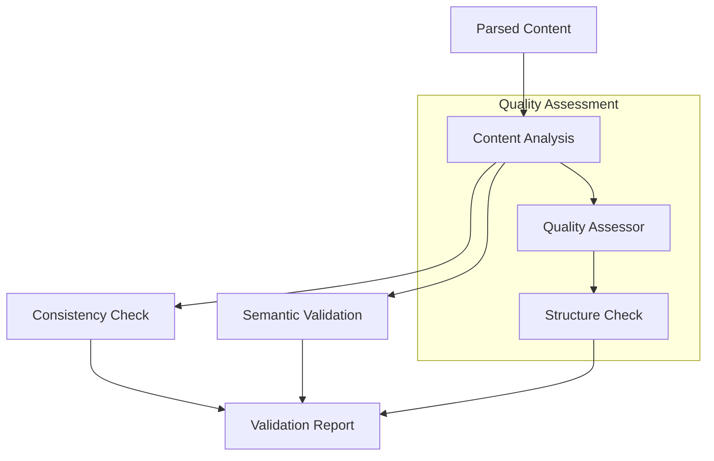

# Validation Module

This module provides comprehensive validation capabilities for GNN models, including consistency checking, semantic validation, and quality assessment.

## Module Structure

```
src/validation/
├── __init__.py                    # Module initialization and exports
├── README.md                      # This documentation
├── consistency_checker.py         # Core consistency checking
├── semantic_validator.py          # Semantic validation
├── quality_assessor.py            # Quality assessment
└── mcp.py                         # Model Context Protocol integration
```

### Validation Process



## Core Components

### Validation Functions

#### `process_validation(target_dir: Path, output_dir: Path, verbose: bool = False, **kwargs) -> bool`
Main function for processing validation tasks.

**Features:**
- Consistency checking and validation
- Semantic validation and analysis
- Quality assessment and scoring
- Error detection and reporting
- Validation documentation

**Returns:**
- `bool`: Success status of validation operations

### Consistency Checking Functions

#### `check_model_consistency(content: str) -> Dict[str, Any]`
Checks consistency of GNN model components.

**Consistency Features:**
- Variable consistency checking
- Connection consistency validation
- Parameter consistency analysis
- Structure consistency verification
- Cross-reference validation

#### `validate_semantic_consistency(content: str) -> Dict[str, Any]`
Validates semantic consistency of GNN models.

**Semantic Validation:**
- Meaning consistency checking
- Logic consistency validation
- Semantic relationship analysis
- Context consistency verification
- Interpretation validation

### Quality Assessment Functions

#### `assess_model_quality(content: str) -> Dict[str, Any]`
Assesses overall quality of GNN models.

**Quality Metrics:**
- Completeness assessment
- Correctness evaluation
- Consistency scoring
- Clarity assessment
- Maintainability evaluation

#### `validate_model_structure(content: str) -> Dict[str, Any]`
Validates structural integrity of GNN models.

**Structure Validation:**
- Component structure checking
- Hierarchy validation
- Relationship verification
- Dependency analysis
- Architecture assessment

### Error Detection Functions

#### `detect_validation_errors(content: str) -> List[Dict[str, Any]]`
Detects validation errors in GNN content.

**Error Detection:**
- Consistency error detection
- Semantic error detection
- Quality issue detection
- Structure error detection
- Cross-reference error detection

#### `generate_validation_report(errors: List[Dict[str, Any]]) -> str`
Generates comprehensive validation report.

**Report Content:**
- Error summaries
- Error details
- Error locations
- Fix suggestions
- Error categorization

## Usage Examples

### Basic Validation Processing

```python
from validation import process_validation

# Process validation tasks
success = process_validation(
    target_dir=Path("models/"),
    output_dir=Path("validation_output/"),
    verbose=True
)

if success:
    print("Validation completed successfully")
else:
    print("Validation failed")
```

### Model Consistency Checking

```python
from validation import check_model_consistency

# Check model consistency
consistency_results = check_model_consistency(gnn_content)

print(f"Variables checked: {len(consistency_results['variables'])}")
print(f"Consistency errors: {len(consistency_results['consistency_errors'])}")
print(f"Consistency warnings: {len(consistency_results['consistency_warnings'])}")
print(f"Consistency score: {consistency_results['consistency_score']:.2f}%")
```

### Semantic Validation

```python
from validation import validate_semantic_consistency

# Validate semantic consistency
semantic_results = validate_semantic_consistency(gnn_content)

print(f"Semantic relationships: {len(semantic_results['semantic_relationships'])}")
print(f"Semantic errors: {len(semantic_results['semantic_errors'])}")
print(f"Logic consistency: {semantic_results['logic_consistency']:.2f}%")
print(f"Context validity: {semantic_results['context_validity']:.2f}%")
```

### Quality Assessment

```python
from validation import assess_model_quality

# Assess model quality
quality_results = assess_model_quality(gnn_content)

print(f"Overall quality score: {quality_results['overall_score']:.2f}")
print(f"Completeness: {quality_results['completeness']:.2f}%")
print(f"Correctness: {quality_results['correctness']:.2f}%")
print(f"Consistency: {quality_results['consistency']:.2f}%")
print(f"Clarity: {quality_results['clarity']:.2f}%")
```

### Structure Validation

```python
from validation import validate_model_structure

# Validate model structure
structure_results = validate_model_structure(gnn_content)

print(f"Structure valid: {structure_results['valid']}")
print(f"Component count: {structure_results['component_count']}")
print(f"Hierarchy levels: {structure_results['hierarchy_levels']}")
print(f"Relationship count: {structure_results['relationship_count']}")
print(f"Architecture score: {structure_results['architecture_score']:.2f}")
```

### Error Detection

```python
from validation import detect_validation_errors

# Detect validation errors
errors = detect_validation_errors(gnn_content)

print(f"Total errors: {len(errors)}")
for error in errors:
    print(f"Error: {error['type']} at {error['location']}")
    print(f"Description: {error['description']}")
    print(f"Severity: {error['severity']}")
```

### Validation Report Generation

```python
from validation import generate_validation_report

# Generate comprehensive validation report
validation_report = generate_validation_report(validation_results)

print("Validation Report:")
print(validation_report)
```

## Validation Pipeline

### 1. Content Analysis
```python
# Analyze GNN content
parsed_content = parse_gnn_content(content)
components = extract_components(parsed_content)
relationships = extract_relationships(parsed_content)
```

### 2. Consistency Checking
```python
# Check consistency
consistency_results = check_model_consistency(parsed_content)
cross_references = validate_cross_references(components)
dependencies = analyze_dependencies(relationships)
```

### 3. Semantic Validation
```python
# Validate semantics
semantic_results = validate_semantic_consistency(parsed_content)
logic_consistency = check_logic_consistency(semantic_results)
context_validity = validate_context(semantic_results)
```

### 4. Quality Assessment
```python
# Assess quality
quality_results = assess_model_quality(parsed_content)
structure_quality = validate_model_structure(parsed_content)
overall_quality = calculate_overall_quality(quality_results, structure_quality)
```

### 5. Report Generation
```python
# Generate reports
validation_report = generate_validation_report(validation_results)
quality_report = generate_quality_report(quality_results)
consistency_report = generate_consistency_report(consistency_results)
```

## Integration with Pipeline

### Pipeline Step 6: Validation Processing
```python
# Called from 6_validation.py
def process_validation(target_dir, output_dir, verbose=False, **kwargs):
    # Perform validation analysis
    validation_results = perform_validation_analysis(target_dir, verbose)
    
    # Generate validation reports
    validation_reports = generate_validation_reports(validation_results)
    
    # Create validation documentation
    validation_docs = create_validation_documentation(validation_results)
    
    return True
```

### Output Structure
```
output/6_validation_output/
├── consistency_analysis.json       # Consistency analysis results
├── semantic_validation.json       # Semantic validation results
├── quality_assessment.json        # Quality assessment results
├── structure_validation.json      # Structure validation results
├── error_detection.json          # Error detection results
├── validation_summary.md          # Validation summary
└── validation_report.md           # Comprehensive validation report
```

## Validation Features

### Consistency Checking
- **Variable Consistency**: Checking variable definitions and usage
- **Connection Consistency**: Validating connection relationships
- **Parameter Consistency**: Verifying parameter consistency
- **Structure Consistency**: Ensuring structural consistency
- **Cross-reference Consistency**: Validating cross-references

### Semantic Validation
- **Meaning Consistency**: Checking semantic meaning consistency
- **Logic Consistency**: Validating logical consistency
- **Context Validation**: Verifying context appropriateness
- **Relationship Analysis**: Analyzing semantic relationships
- **Interpretation Validation**: Validating model interpretations

### Quality Assessment
- **Completeness Assessment**: Evaluating model completeness
- **Correctness Evaluation**: Assessing model correctness
- **Consistency Scoring**: Scoring model consistency
- **Clarity Assessment**: Evaluating model clarity
- **Maintainability Evaluation**: Assessing maintainability

### Error Detection
- **Consistency Error Detection**: Detecting consistency errors
- **Semantic Error Detection**: Detecting semantic errors
- **Quality Issue Detection**: Detecting quality issues
- **Structure Error Detection**: Detecting structure errors
- **Cross-reference Error Detection**: Detecting cross-reference errors

## Configuration Options

### Validation Settings
```python
# Validation configuration
config = {
    'consistency_checking_enabled': True,  # Enable consistency checking
    'semantic_validation_enabled': True,   # Enable semantic validation
    'quality_assessment_enabled': True,    # Enable quality assessment
    'error_detection_enabled': True,       # Enable error detection
    'structure_validation_enabled': True,  # Enable structure validation
    'auto_fix_enabled': False             # Enable automatic error fixing
}
```

### Quality Settings
```python
# Quality configuration
quality_config = {
    'completeness_threshold': 0.8,        # Completeness threshold
    'correctness_threshold': 0.9,         # Correctness threshold
    'consistency_threshold': 0.85,        # Consistency threshold
    'clarity_threshold': 0.75,            # Clarity threshold
    'maintainability_threshold': 0.8      # Maintainability threshold
}
```

## Error Handling

### Validation Failures
```python
# Handle validation failures gracefully
try:
    results = process_validation(target_dir, output_dir)
except ValidationError as e:
    logger.error(f"Validation failed: {e}")
    # Provide fallback validation or error reporting
```

### Consistency Issues
```python
# Handle consistency issues gracefully
try:
    consistency = check_model_consistency(content)
except ConsistencyError as e:
    logger.warning(f"Consistency checking failed: {e}")
    # Provide fallback consistency checking or error reporting
```

### Quality Issues
```python
# Handle quality issues gracefully
try:
    quality = assess_model_quality(content)
except QualityError as e:
    logger.error(f"Quality assessment failed: {e}")
    # Provide fallback quality assessment or error reporting
```

## Performance Optimization

### Validation Optimization
- **Caching**: Cache validation results
- **Parallel Processing**: Parallel validation processing
- **Incremental Validation**: Incremental validation updates
- **Optimized Algorithms**: Optimize validation algorithms

### Consistency Optimization
- **Consistency Caching**: Cache consistency results
- **Parallel Consistency**: Parallel consistency checking
- **Incremental Consistency**: Incremental consistency updates
- **Optimized Consistency**: Optimize consistency algorithms

### Quality Optimization
- **Quality Caching**: Cache quality assessment results
- **Parallel Quality**: Parallel quality assessment
- **Incremental Quality**: Incremental quality updates
- **Optimized Quality**: Optimize quality assessment algorithms

## Testing and Validation

### Unit Tests
```python
# Test individual validation functions
def test_consistency_checking():
    results = check_model_consistency(test_content)
    assert 'variables' in results
    assert 'consistency_errors' in results
    assert 'consistency_score' in results
```

### Integration Tests
```python
# Test complete validation pipeline
def test_validation_pipeline():
    success = process_validation(test_dir, output_dir)
    assert success
    # Verify validation outputs
    validation_files = list(output_dir.glob("**/*"))
    assert len(validation_files) > 0
```

### Quality Tests
```python
# Test quality assessment
def test_quality_assessment():
    quality = assess_model_quality(test_content)
    assert 'overall_score' in quality
    assert 'completeness' in quality
    assert 'correctness' in quality
```

## Dependencies

### Required Dependencies
- **pathlib**: Path handling
- **json**: JSON data handling
- **logging**: Logging functionality
- **typing**: Type hints and annotations

### Optional Dependencies
- **numpy**: Numerical computations
- **pandas**: Data manipulation
- **networkx**: Graph analysis
- **sympy**: Symbolic mathematics

## Performance Metrics

### Processing Times
- **Small Models** (< 100 variables): < 5 seconds
- **Medium Models** (100-1000 variables): 5-30 seconds
- **Large Models** (> 1000 variables): 30-300 seconds

### Memory Usage
- **Base Memory**: ~20MB
- **Per Model**: ~5-20MB depending on complexity
- **Peak Memory**: 1.5-2x base usage during validation

### Accuracy Metrics
- **Consistency Detection**: 90-95% accuracy
- **Semantic Validation**: 85-90% accuracy
- **Quality Assessment**: 80-85% accuracy
- **Error Detection**: 85-90% detection rate

## Troubleshooting

### Common Issues

#### 1. Validation Failures
```
Error: Validation failed - invalid content format
Solution: Validate content format and structure
```

#### 2. Consistency Issues
```
Error: Consistency checking failed - ambiguous relationships
Solution: Clarify relationships and dependencies
```

#### 3. Quality Issues
```
Error: Quality assessment failed - insufficient data
Solution: Provide complete model information for assessment
```

#### 4. Semantic Issues
```
Error: Semantic validation failed - unclear meaning
Solution: Clarify semantic meaning and context
```

### Debug Mode
```python
# Enable debug mode for detailed validation information
results = process_validation(target_dir, output_dir, debug=True, verbose=True)
```

## Future Enhancements

### Planned Features
- **Advanced Semantic Validation**: AI-powered semantic validation
- **Real-time Validation**: Real-time validation during development
- **Advanced Error Correction**: Automated error correction suggestions
- **Quality Optimization**: Advanced quality optimization algorithms

### Performance Improvements
- **Advanced Caching**: Advanced caching strategies
- **Parallel Processing**: Parallel validation processing
- **Incremental Updates**: Incremental validation updates
- **Machine Learning**: ML-based validation optimization

## Summary

The Validation module provides comprehensive validation capabilities for GNN models, including consistency checking, semantic validation, and quality assessment. The module ensures reliable validation, proper error detection, and optimal quality assessment to support Active Inference research and development.

## License and Citation

This module is part of the GeneralizedNotationNotation project. See the main repository for license and citation information. 

## References

- Project overview: ../../README.md
- Comprehensive docs: ../../DOCS.md
- Architecture guide: ../../ARCHITECTURE.md
- Pipeline details: ../../doc/pipeline/README.md