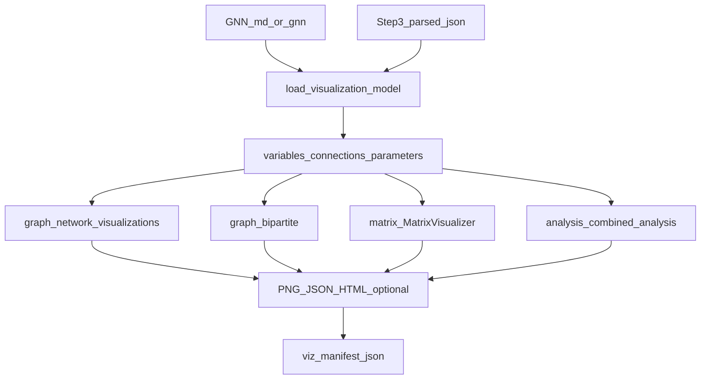
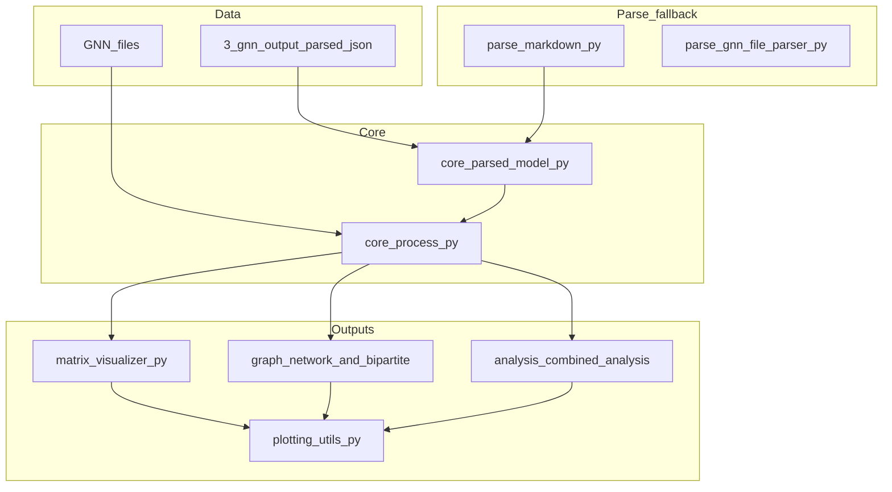
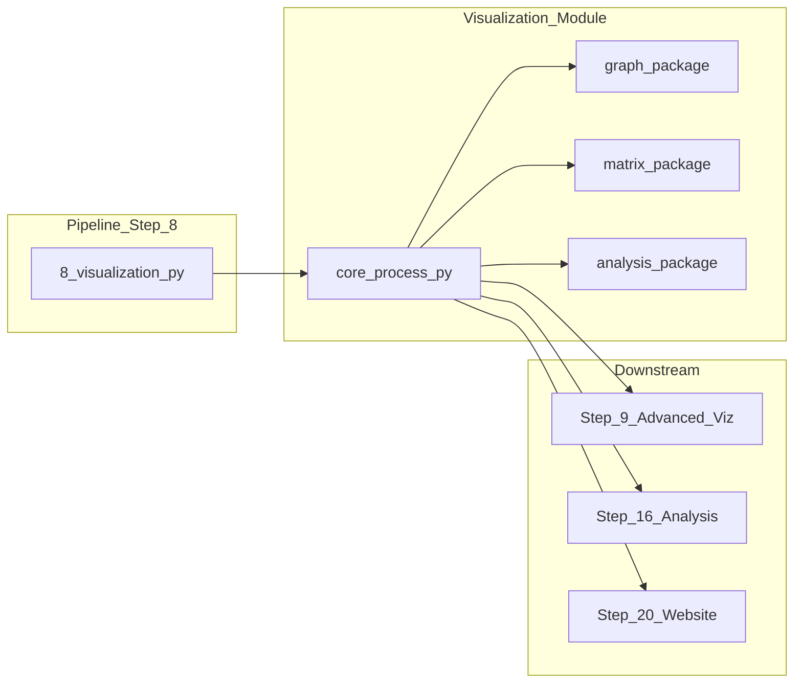

# Visualization Module

This module provides comprehensive visualization capabilities for GNN models, including graph visualization, matrix visualization, and interactive plotting.

## Module Structure

```
src/visualization/
├── __init__.py                 # Public exports (MatrixVisualizer, process_visualization, …)
├── processor.py                # Shim: core + parse + plotting re-exports
├── core/                       # process.py, parsed_model.py (JSON-first loader); [README](core/README.md)
├── parse/                      # markdown.py, gnn_file_parser.py (GNNParser); [README](parse/README.md)
├── plotting/                   # utils.py (Agg, save_plot_safely); [README](plotting/README.md)
├── graph/                      # network_visualizations.py, bipartite.py; [README](graph/README.md)
├── matrix/                     # visualizer.py, extract.py, compat.py; [README](matrix/README.md)
├── analysis/                   # combined_analysis.py; [README](analysis/README.md)
├── ontology/                   # visualizer.py; [README](ontology/README.md)
├── compat/                     # viz_compat.py (plt/np/sns); [README](compat/README.md)
├── visualizer.py               # GNNVisualizer (optional CLI)
├── matrix_visualizer.py        # Shim → matrix/
├── parser.py                   # Shim → parse/
├── network_visualizations.py   # Shim → graph/
├── combined_analysis.py        # Shim → analysis/
├── mcp.py                      # MCP tools
└── cli.py                      # Module CLI
```

**Data path:** When step 3 has written `output/3_gnn_output/{model}/{model}_parsed.json` and it is at least as new as the source `.md`, visualization uses that JSON for variables, connections, parameters, ontology, and `raw_sections`. Otherwise it parses markdown with `parse_gnn_content`.

### Visualization Pipeline



### Visualization Architecture



### Module Integration Flow



## Public API (accurate)

| Symbol | Role |
|--------|------|
| `process_visualization` | Step-8 batch: all `*.md` / `*.gnn` in `target_dir` → per-model folder under `output_dir` |
| `load_visualization_model` | [`core/parsed_model.py`](core/parsed_model.py): JSON-first from step 3, else markdown |
| `parse_gnn_content` | [`parse/markdown.py`](parse/markdown.py): markdown fallback |
| `GNNParser` | [`parse/gnn_file_parser.py`](parse/gnn_file_parser.py): file-oriented parse (e.g. multi-file combined chart) |
| `MatrixVisualizer` | [`matrix/visualizer.py`](matrix/visualizer.py): heatmaps, 3D tensors, POMDP panels |
| `generate_network_visualizations` | [`graph/network_visualizations.py`](graph/network_visualizations.py): graph PNG, stats JSON, optional Plotly HTML, ontology legend |
| `generate_variable_parameter_bipartite` | [`graph/bipartite.py`](graph/bipartite.py) |
| `generate_combined_analysis` / `generate_combined_visualizations` | [`analysis/combined_analysis.py`](analysis/combined_analysis.py) |
| `GNNVisualizer` | [`visualizer.py`](visualizer.py): optional class API for ad hoc graph/matrix generation |

Interactive HTML for the network is produced only when Plotly is installed; most outputs are PNG + JSON.

## Usage examples

```python
from pathlib import Path
from visualization import process_visualization

process_visualization(
    Path("input/gnn_files"),
    Path("output/8_visualization_output"),
    verbose=True,
)
```

```python
from pathlib import Path
from visualization.matrix import MatrixVisualizer
import numpy as np

mv = MatrixVisualizer()
mv.generate_matrix_heatmap("demo", np.eye(4), Path("out/demo.png"))
```

```python
from pathlib import Path
from visualization.core.parsed_model import load_visualization_model

content = Path("model.md").read_text(encoding="utf-8")
data = load_visualization_model(Path("model.md"), content, Path("output/8_visualization_output"))
```

CLI: `python -m visualization` (see [`__main__.py`](__main__.py)).

## Processing order (inside `process_single_gnn_file`)

1. Load model dict (parsed JSON or markdown).
2. Optional downsampling for very large variable lists.
3. Network graph + stats + optional ontology TSV legend + optional Plotly HTML.
4. Variable–parameter bipartite PNG (when parameters exist).
5. Matrix heatmaps / tensors from parameters.
6. Combined analysis panels and generative schematic.
7. `{model}_viz_manifest.json` listing artifacts and `_viz_meta`.

## Integration with Pipeline

`8_visualization.py` calls `process_visualization` only (no separate report generator inside this module).

### Output layout (typical)

```
output/8_visualization_output/
├── visualization_summary.json
└── {model}/
    ├── {model}_network_graph.png
    ├── {model}_network_stats.json
    ├── {model}_ontology_legend.txt          # if ontology_labels present
    ├── {model}_viz_manifest.json
    ├── {model}_combined_analysis.png
    └── …
```

## Step-8 feature set (implemented)

- **Graph:** Spring layout; directed vs undirected per GNN `connection_type`; variable-type colors; ontology text on nodes; `{model}_ontology_legend.txt` when `ontology_labels` is non-empty; `{model}_network_stats.json` includes `gnn_edge_orientation` counts.
- **Matrix:** Heatmaps and 3D-style transition tensors from parameters; optional seaborn in multi-matrix analysis.
- **Combined:** Four-panel summary, standalone panels, fixed POMDP schematic diagram.
- **Bipartite:** Variables vs parameter names (`graph/bipartite.py`).
- **Sidecars:** `{model}_viz_manifest.json`, run `visualization_summary.json`, optional `*_viz_source_note.txt` when step-3 JSON is stale.

## Configuration

No central `config` dict in this module. Use pipeline output layout (so step-3 JSON is discoverable), install plotly for HTML networks, pass `verbose=True`, and rely on automatic sampling when variable counts are large.

## Error handling

Failures in network, matrix, or combined branches are isolated per subsection. `process_visualization` returns `True` if the run produced at least one output path in total.

## Tests

`uv run pytest src/tests/test_visualization_*.py -v` — full suite `uv run pytest src/tests/ -v`.

## Dependencies

- **Typically required:** matplotlib, networkx, numpy.
- **Optional:** plotly (HTML network), seaborn (matrix panels).

## Summary

Step 8 produces PNG/JSON/TSV artifacts from GNN files, preferring step-3 parsed JSON. Richer interactive and D2-style outputs live in step 9 (`advanced_visualization`).

## License and Citation

This module is part of the GeneralizedNotationNotation project. See the main repository for license and citation information. 

## References

- Project overview: ../../README.md
- Comprehensive docs: ../../DOCS.md
- Architecture guide: ../../ARCHITECTURE.md
- Pipeline details: ../../doc/pipeline/README.md

---
## Documentation
- **[README](README.md)**: Module Overview
- **[AGENTS](AGENTS.md)**: Agentic Workflows
- **[SPEC](SPEC.md)**: Architectural Specification
- **[SKILL](SKILL.md)**: Capability API
