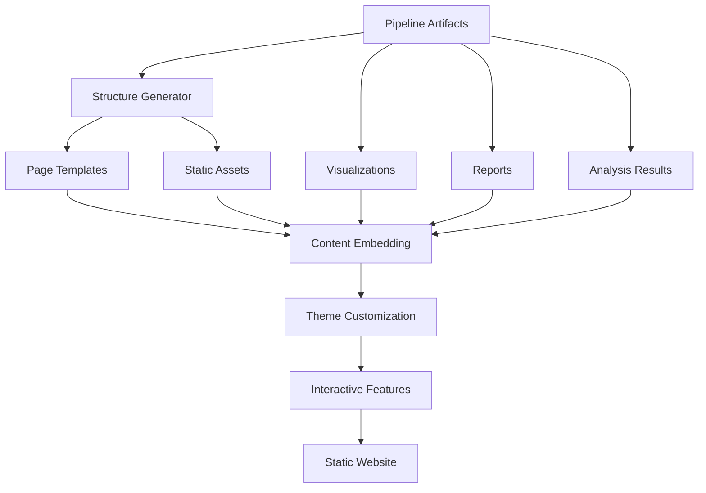

# Website Module

This module provides comprehensive static HTML website generation capabilities for the GNN pipeline, creating interactive websites from pipeline artifacts including visualizations, reports, analysis results, and documentation.

## Module Structure

```
src/website/
├── __init__.py                    # Module initialization and exports
├── README.md                      # This documentation
├── generator.py                    # Core website generation
├── templates/                      # HTML templates
│   ├── base.html                  # Base template
│   ├── index.html                 # Homepage template
│   ├── visualization.html         # Visualization page template
│   ├── report.html                # Report page template
│   └── analysis.html              # Analysis page template
├── static/                        # Static assets
│   ├── css/                       # CSS stylesheets
│   ├── js/                        # JavaScript files
│   └── images/                    # Image assets
└── mcp.py                         # Model Context Protocol integration
```

## Core Components

### Website Generation Functions

#### `process_website(target_dir: Path, output_dir: Path, verbose: bool = False, **kwargs) -> bool`
Main function for processing website generation tasks.

**Features:**
- Static HTML website generation
- Pipeline artifact integration
- Interactive visualization embedding
- Report and analysis presentation
- Website documentation

**Returns:**
- `bool`: Success status of website operations

### Website Generation System

#### `generate_website_structure(output_dir: Path) -> bool`
Generates the basic website structure.

**Structure Features:**
- Directory organization
- Template setup
- Static asset integration
- Navigation structure
- Responsive design

#### `embed_visualizations(visualization_dir: Path, website_dir: Path) -> bool`
Embeds pipeline visualizations into the website.

**Embedding Features:**
- Interactive plot integration
- Static image embedding
- Responsive design
- Performance optimization
- Cross-browser compatibility

#### `embed_reports(report_dir: Path, website_dir: Path) -> bool`
Embeds pipeline reports into the website.

**Report Features:**
- HTML report integration
- PDF report linking
- Markdown rendering
- Search functionality
- Navigation integration

#### `embed_analysis_results(analysis_dir: Path, website_dir: Path) -> bool`
Embeds analysis results into the website.

**Analysis Features:**
- Statistical results presentation
- Performance metrics display
- Interactive charts
- Data tables
- Export functionality

### Website Customization Functions

#### `customize_website_theme(theme_config: Dict[str, Any]) -> bool`
Customizes the website theme and styling.

**Theme Features:**
- Color scheme customization
- Typography settings
- Layout customization
- Branding integration
- Responsive design

#### `add_interactive_features(website_dir: Path) -> bool`
Adds interactive features to the website.

**Interactive Features:**
- Search functionality
- Filtering capabilities
- Sorting options
- Zoom and pan controls
- Export capabilities

## Usage Examples

### Basic Website Generation

```python
from website import process_website

# Generate website from pipeline artifacts
success = process_website(
    target_dir=Path("pipeline_artifacts/"),
    output_dir=Path("website_output/"),
    verbose=True
)

if success:
    print("Website generation completed successfully")
else:
    print("Website generation failed")
```

### Website Structure Generation

```python
from website import generate_website_structure

# Generate basic website structure
success = generate_website_structure(
    output_dir=Path("website/")
)

if success:
    print("Website structure created successfully")
else:
    print("Website structure creation failed")
```

### Visualization Embedding

```python
from website import embed_visualizations

# Embed pipeline visualizations
success = embed_visualizations(
    visualization_dir=Path("output/8_visualization_output/"),
    website_dir=Path("website/")
)

if success:
    print("Visualizations embedded successfully")
else:
    print("Visualization embedding failed")
```

### Report Embedding

```python
from website import embed_reports

# Embed pipeline reports
success = embed_reports(
    report_dir=Path("output/23_report_output/"),
    website_dir=Path("website/")
)

if success:
    print("Reports embedded successfully")
else:
    print("Report embedding failed")
```

### Analysis Results Embedding

```python
from website import embed_analysis_results

# Embed analysis results
success = embed_analysis_results(
    analysis_dir=Path("output/16_analysis_output/"),
    website_dir=Path("website/")
)

if success:
    print("Analysis results embedded successfully")
else:
    print("Analysis embedding failed")
```

### Website Customization

```python
from website import customize_website_theme

# Customize website theme
theme_config = {
    "primary_color": "#2c3e50",
    "secondary_color": "#3498db",
    "font_family": "Roboto, sans-serif",
    "layout": "modern",
    "branding": {
        "logo": "logo.png",
        "title": "GNN Pipeline Results"
    }
}

success = customize_website_theme(theme_config)

if success:
    print("Website theme customized successfully")
else:
    print("Website customization failed")
```

### Interactive Features

```python
from website import add_interactive_features

# Add interactive features
success = add_interactive_features(
    website_dir=Path("website/")
)

if success:
    print("Interactive features added successfully")
else:
    print("Interactive features addition failed")
```

## Website Structure



### Generated Website Layout
```
website/
├── index.html                      # Homepage
├── visualizations/                 # Visualization pages
│   ├── graphs.html                 # Graph visualizations
│   ├── matrices.html               # Matrix visualizations
│   └── interactive.html            # Interactive plots
├── reports/                        # Report pages
│   ├── pipeline_report.html        # Pipeline report
│   ├── analysis_report.html        # Analysis report
│   └── validation_report.html      # Validation report
├── analysis/                       # Analysis pages
│   ├── statistics.html             # Statistical analysis
│   ├── performance.html            # Performance metrics
│   └── comparisons.html            # Model comparisons
├── static/                         # Static assets
│   ├── css/                        # Stylesheets
│   ├── js/                         # JavaScript
│   └── images/                     # Images
└── assets/                         # Pipeline artifacts
    ├── visualizations/             # Visualization files
    ├── reports/                    # Report files
    └── analysis/                   # Analysis files
```

### Website Features

#### Homepage Features
- **Pipeline Overview**: Summary of pipeline execution
- **Quick Navigation**: Links to key sections
- **Recent Results**: Latest pipeline outputs
- **Status Dashboard**: Pipeline execution status
- **Search Functionality**: Site-wide search

#### Visualization Features
- **Interactive Plots**: Zoom, pan, and hover interactions
- **Static Images**: High-quality static visualizations
- **Responsive Design**: Mobile-friendly layouts
- **Export Options**: Download capabilities
- **Filtering**: Data filtering and selection

#### Report Features
- **HTML Reports**: Embedded HTML reports
- **PDF Links**: Links to PDF versions
- **Markdown Rendering**: Rendered markdown content
- **Search**: Report content search
- **Navigation**: Cross-report navigation

#### Analysis Features
- **Statistical Tables**: Data tables with sorting
- **Performance Charts**: Performance visualization
- **Comparison Tools**: Model comparison interfaces
- **Export Options**: Data export capabilities
- **Interactive Elements**: Dynamic content updates

## Configuration Options

### Website Configuration
```python
# Website configuration
website_config = {
    'title': 'GNN Pipeline Results',
    'description': 'Active Inference pipeline results and analysis',
    'theme': 'modern',
    'responsive': True,
    'interactive': True,
    'search_enabled': True,
    'export_enabled': True
}
```

### Theme Configuration
```python
# Theme configuration
theme_config = {
    'primary_color': '#2c3e50',
    'secondary_color': '#3498db',
    'accent_color': '#e74c3c',
    'font_family': 'Roboto, sans-serif',
    'font_size': '16px',
    'layout': 'modern',
    'branding': {
        'logo': 'logo.png',
        'title': 'GNN Pipeline',
        'subtitle': 'Active Inference Research'
    }
}
```

### Embedding Configuration
```python
# Embedding configuration
embedding_config = {
    'visualizations': {
        'interactive': True,
        'responsive': True,
        'export_formats': ['png', 'svg', 'pdf'],
        'max_width': '100%',
        'height': 'auto'
    },
    'reports': {
        'include_pdfs': True,
        'markdown_rendering': True,
        'search_enabled': True,
        'navigation': True
    },
    'analysis': {
        'tables': True,
        'charts': True,
        'export': True,
        'filtering': True
    }
}
```

## Error Handling

### Website Generation Failures
```python
# Handle website generation failures gracefully
try:
    success = process_website(target_dir, output_dir)
except WebsiteError as e:
    logger.error(f"Website generation failed: {e}")
    # Provide fallback website or error reporting
```

### Embedding Issues
```python
# Handle embedding issues gracefully
try:
    success = embed_visualizations(viz_dir, website_dir)
except EmbeddingError as e:
    logger.warning(f"Visualization embedding failed: {e}")
    # Provide fallback embedding or error reporting
```

### Customization Issues
```python
# Handle customization issues gracefully
try:
    success = customize_website_theme(theme_config)
except CustomizationError as e:
    logger.error(f"Website customization failed: {e}")
    # Provide fallback theme or error reporting
```

## Performance Optimization

### Website Optimization
- **Static Generation**: Pre-generate all HTML content
- **Asset Optimization**: Compress CSS, JS, and images
- **Caching**: Implement browser caching
- **CDN Integration**: Use CDN for static assets

### Embedding Optimization
- **Lazy Loading**: Load content on demand
- **Image Optimization**: Compress and optimize images
- **JavaScript Optimization**: Minify and bundle JS
- **CSS Optimization**: Minify and combine CSS

### Customization Optimization
- **Theme Caching**: Cache theme configurations
- **Template Optimization**: Optimize HTML templates
- **Asset Management**: Efficient asset handling
- **Build Optimization**: Optimize build process

## Testing and Validation

### Unit Tests
```python
# Test individual website functions
def test_website_generation():
    success = generate_website_structure(test_output_dir)
    assert success
    assert test_output_dir.exists()
```

### Integration Tests
```python
# Test complete website pipeline
def test_website_pipeline():
    success = process_website(test_dir, output_dir)
    assert success
    # Verify website outputs
    website_files = list(output_dir.glob("**/*"))
    assert len(website_files) > 0
```

### Validation Tests
```python
# Test website validation
def test_website_validation():
    validation = validate_website_structure(website_dir)
    assert 'valid' in validation
    assert 'missing_files' in validation
    assert 'broken_links' in validation
```

## Dependencies

### Required Dependencies
- **pathlib**: Path handling
- **jinja2**: Template engine
- **markdown**: Markdown processing
- **json**: JSON data handling
- **logging**: Logging functionality

### Optional Dependencies
- **plotly**: Interactive plotting
- **matplotlib**: Static plotting
- **pandas**: Data manipulation
- **numpy**: Numerical computing
- **flask**: Web framework (for development)

## Performance Metrics

### Generation Performance
- **Website Generation**: 10-60 seconds depending on content
- **Template Rendering**: < 5 seconds per template
- **Asset Processing**: 5-30 seconds for asset optimization
- **File Size**: 1-50MB depending on content

### Embedding Performance
- **Visualization Embedding**: 5-20 seconds per visualization
- **Report Embedding**: 2-10 seconds per report
- **Analysis Embedding**: 3-15 seconds per analysis
- **Memory Usage**: 50-200MB during embedding

### Customization Performance
- **Theme Application**: < 5 seconds
- **Template Customization**: < 3 seconds
- **Asset Integration**: 2-10 seconds
- **Build Time**: 5-30 seconds

## Troubleshooting

### Common Issues

#### 1. Website Generation Failures
```
Error: Website generation failed - template not found
Solution: Check template directory and file paths
```

#### 2. Embedding Issues
```
Error: Visualization embedding failed - file format not supported
Solution: Check file formats and conversion capabilities
```

#### 3. Customization Issues
```
Error: Website customization failed - invalid theme configuration
Solution: Validate theme configuration parameters
```

#### 4. Performance Issues
```
Error: Website generation timeout - large file processing
Solution: Optimize file processing and implement chunking
```

### Debug Mode
```python
# Enable debug mode for detailed website information
results = process_website(target_dir, output_dir, debug=True, verbose=True)
```

## Future Enhancements

### Planned Features
- **Dynamic Content**: Server-side dynamic content generation
- **User Authentication**: User login and access control
- **Real-time Updates**: Live pipeline result updates
- **Advanced Search**: Full-text search with filters

### Performance Improvements
- **Advanced Caching**: Advanced caching strategies
- **Parallel Processing**: Parallel website generation
- **Incremental Updates**: Incremental website updates
- **Machine Learning**: ML-based content optimization

## Summary

The Website module provides comprehensive static HTML website generation capabilities for the GNN pipeline, creating interactive websites from pipeline artifacts including visualizations, reports, analysis results, and documentation. The module ensures reliable website generation, proper artifact integration, and optimal user experience through responsive design and interactive features.

## License and Citation

This module is part of the GeneralizedNotationNotation project. See the main repository for license and citation information. 

## References

- Project overview: ../../README.md
- Comprehensive docs: ../../DOCS.md
- Architecture guide: ../../ARCHITECTURE.md
- Pipeline details: ../../doc/pipeline/README.md