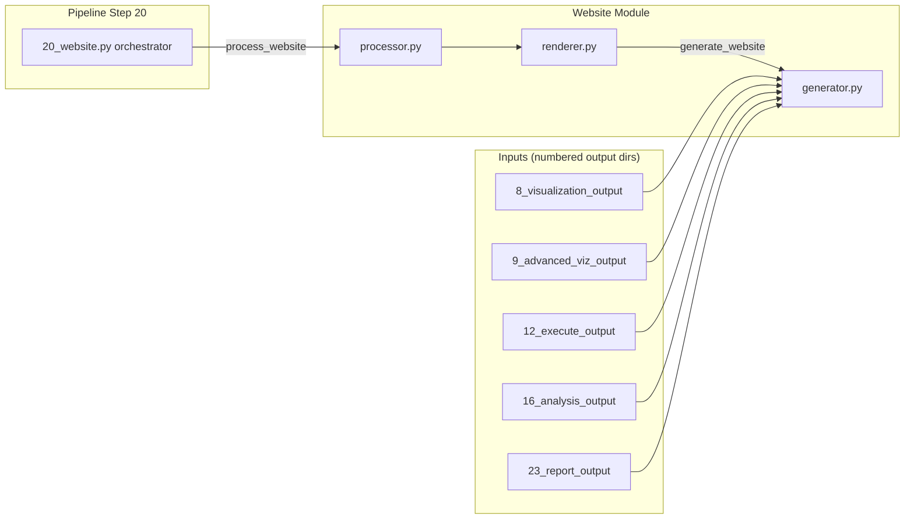

# Website Module

Static HTML website generation for the GNN pipeline: produces a premium,
dark-mode, multi-page site from pipeline artifacts (visualizations, reports,
analysis results, GNN source files, execution summaries, and the MCP tool
registry).

## Module Structure

```
src/website/
├── __init__.py        # Public exports (see API below)
├── processor.py       # Thin facade re-exporting renderer.process_website
├── renderer.py        # process_website + embed_* helpers + get_module_info
├── generator.py       # WebsiteGenerator / generate_website (7-page site)
├── dashboard.py       # render_dashboard — standalone interactive dashboard
└── mcp.py             # MCP tool registration (5 tools)
```

No `templates/` or `static/` directory ships in the module; pages are built
with inline CSS/HTML. `WebsiteGenerator.__init__` references `templates/` and
`static/` paths defensively but only copies `static/` if it exists.

### Pipeline Integration


```mermaid
flowchart LR
    subgraph "Pipeline Step 20"
        Step20[20_website.py orchestrator]
    end

    subgraph "Website Module"
        Processor[processor.py]
        Renderer[renderer.py]
        Generator[generator.py]
    end

    Step20 -->|process_website| Processor
    Processor --> Renderer
    Renderer -->|generate_website| Generator

    subgraph "Inputs (numbered output dirs)"
        Step8[8_visualization_output]
        Step9[9_advanced_viz_output]
        Step12[12_execute_output]
        Step16[16_analysis_output]
        Step23[23_report_output]
    end

    Step8 --> Generator
    Step9 --> Generator
    Step12 --> Generator
    Step16 --> Generator
    Step23 --> Generator
```

The site aggregates Step 8/9 visualizations, Step 12 execution summaries,
Step 16 analysis JSON, and Step 23 reports discovered under the
`pipeline_output_root` (defaults to `output_dir.parent`).

## API

### `process_website(target_dir: Path, output_dir: Path, verbose: bool = False, pipeline_output_root: Path | None = None, **kwargs) -> bool`

Top-level entry point called by `20_website.py`. Creates `output_dir`,
delegates to `generate_website`, and writes a minimal `website_results.json`
manifest. Returns `True` on success.

```python
from website import process_website
from pathlib import Path

success = process_website(
    target_dir=Path("output"),
    output_dir=Path("output/20_website_output"),
    verbose=True,
)
```

The orchestrator (`20_website.py`) also passes `--website-html-filename`
through `**kwargs`; it is accepted and not used by the generator.

### `generate_website(logger, input_dir, output_dir, *, pipeline_output_root=None) -> dict`

Module-level convenience in `generator.py`. Returns a result dict
`{success, pages_created, errors, warnings}`. Raises nothing — failures are
reported in `errors`.

### `WebsiteGenerator`

Class backing `generate_website`. `generate_website(website_data)` builds the
seven pages listed under Output. `create_pages(output_dir, data)` is an
alternate entry point that performs the same build.

### Embedding helpers (`renderer.py`)

All return `bool`:

- `embed_image(image_path, output_file)`
- `embed_markdown_file(md_path, output_file)`
- `embed_text_file(text_path, output_file)`
- `embed_json_file(json_path, output_file)`
- `embed_html_file(html_path, output_file)`
- `generate_html_report(content, output_file)`

### Introspection / validation

- `get_module_info() -> dict` — module features and supported file types.
- `get_supported_file_types() -> list[str]` — flat list of extensions.
- `validate_website_config(config: dict | str) -> bool | dict` — light
  validation helper (accepts a dict or a simple string for tests).

### `render_dashboard(results_dir, output_path, summary_path=None) -> ...`

`dashboard.py` renders a standalone interactive dashboard HTML page. Note:
this page loads Mermaid from a CDN (`cdn.jsdelivr.net`), so unlike the main
site it is not fully offline-self-contained.

## Output

`generate_website` writes seven HTML pages plus `website_results.json`:

```
output/20_website_output/
├── index.html          # Pipeline dashboard with step cards
├── pipeline.html       # Full 25-step pipeline status table
├── gnn_files.html      # GNN source file browser
├── analysis.html       # Analysis and complexity metrics
├── visualization.html  # Gallery of generated visualizations
├── reports.html        # JSON/text report viewer
├── mcp.html            # MCP tools registry across all modules
├── website_results.json
└── assets/
```

## CLI

```bash
# Run only the website step
python src/20_website.py --target-dir input/gnn_files --output-dir output --verbose

# As part of the full pipeline
python src/main.py --only-steps 20 --verbose
```

`20_website.py` adds `--website-html-filename` (default
`gnn_pipeline_summary_website.html`); it is forwarded through `**kwargs`.

## Dependencies

Stdlib only (`logging`, `pathlib`, `json`, `shutil`, `datetime`, `html`).
No optional pip extra is required to import or run this module — Jinja2,
Markdown, and Bleach are **not** used. The orchestrator relies on the core
`utils.pipeline_template` utility.

## MCP Tools

Registered in `mcp.py` (`register_tools`):

- `process_website`
- `build_website_from_pipeline_output`
- `get_website_status`
- `list_generated_website_pages`
- `get_website_module_info`

## Testing

```bash
uv run --extra dev python -m pytest src/tests/website/ \
    --cov=src/website --cov-report=term-missing
```

Test files: `test_website_overall.py`, `test_website_public_api.py`,
`test_website_dashboard.py`.

## Troubleshooting

### Website generation fails (no HTML written)

- Confirm prior steps produced numbered output dirs under
  `pipeline_output_root` (defaults to `output_dir.parent`).
- Run with `--verbose` for per-page error logging.
- `process_website` returns `False` and logs the failing reason if
  `target_dir` does not exist.

### Embedded content missing

`embed_*` helpers return `False` when the source file is absent or unreadable;
check return values and that paths are absolute or resolvable from the cwd.

---
## Documentation
- **[README](README.md)**: Module Overview
- **[AGENTS](AGENTS.md)**: Agentic Workflows
- **[SPEC](SPEC.md)**: Architectural Specification
- **[SKILL](SKILL.md)**: Capability API